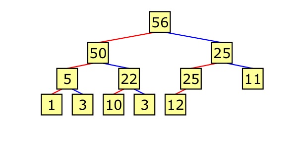
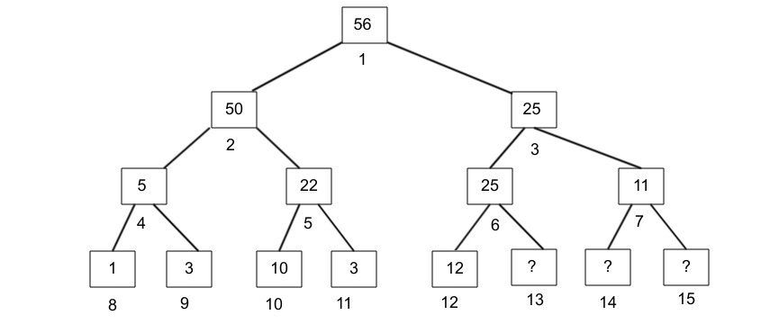

# Heap  and Priority Queues

## Description

A heap is a complete binary tree, i.e., a binary tree in which nodes are added from left to the right until the level is complete, and in which no node has a key that is less than the key of either of its children. In a complete binary tree
the height of the left subtree is at most one more than the height of the right subtree. Unlike a binary search tree, in a heap the ordering of siblings is undetermined.



**Figure 1. Logical Structure of a binary heap.** From: https://www.cs.uaf.edu/2009/spring/cs311/slides/cs311_20090417_heap_pq_stl.pdf

While a heap is a type of complete binary tree, it can be unique represented by storing its level order traversal in an array. In the array representation below, index zero is unoccupied, and the root is placed at index one. 



**Figure 1. Numbering the Nodes of a Complete Binary Heap.** 


In the array representation of a heap no space is required for pointers; instead, the parent and children of each node can be found by simple arithmetic on array indices:

|method|result|
|------|------|
|<pre>Parent(i) = i / 2</pre>|returns position of parent|
|<pre>Left(i)  = 2 * i</pre>|returns left child position|
|<pre>Right(i) = 2 * i + 1</pre>|returns right child position|


If instead of one, we begin the array at index zero, the calculations for the position of a node's parent and its two children become:

|method|result|
|------|------|
|<pre> Parent(i) - (i - 1)/2</pre>|returns position of parent|
|<pre> Left(i)  - 2 * i + 1</pre>|returns left child position|
|<pre> Right(i) - 2 * i + 2</pre>|returns right child position|

.. todo:: Organize the remaining discussion after reading the bookmarked articles and understanding them and how they flow.

## Max Heap Operations

The abstract heap data type has three primary operatons:

1. **peekTop()**  
2. **add(int priority, const T& t)** 
3. **remove()**

**peekTop()** retrieve the root of the tree. **add(int priority, const T& t)** adds a new node to the end of the heap, which then "trickles up" to its position in the ordering. **remove()**  deletes the root and reheapifyies array by making the last
item the root, and then moving in downward until we again have a value heap.  


## Code of Array Implementation of Max Heap

### **add(int priority, const T& t)** Code 

Pseudocode for Adding an Element to Max Heap:

1. Place the new element in the heap in the last location. 
2. Repair the heap ordering by swapping the element with its parent(s) as long as the new element has the greater value.

## C++ Code

The C++ implementation uses a functor to do the comparison operation. This allows the same code to be used for both a max heap and a min heap.

```cpp
    template<class T, class Comp=std::less<int> > class heap;  // forward declaration
    
    template<class T> class max_heap : public heap<T>  {};     // max_heap
    template<class T> class min_heap : public heap<T, std::greater<T>>  {};  // min_heap
    
    template<class T, class Comp> class heap {
      
        class Node {
         // snip...
        };        
    
        std::vector<Node> vec;
        Comp compare_functor;
        
        int size;
    
        bool compare(const Node& lhs, const Node& rhs)
        {
           return compare_functor(lhs.getPriority(), rhs.getPriority());		
        }	
    
       heap(int sz) : vec(sz), size{0} {}
    
       heap() : vec(), size{0} {}
    
       // snip....
     };
```

### add(int priority, const T& data)

Add places the new item at the end of the heap, and then swaps it with its parent until the heap property is re-established, i.e., the parent is not less than either of its children (in the case of a max heap).

```cpp
  template<class T, class Comp> void heap<T, Comp>::add(int x, const T& t)
  {
      ++size;
  
      vec.push_back(Node(x, t)); 
  
      int index = vec.size() - 1;
  
      swim(index); // repair heap property
  }
  
  template<class T, class Comp> void heap<T, Comp>::swim(int index)
  {
      // Move new item up until we have a valid heap
      int parentIndex;
  
      while (index > 0) { 
  
          parentIndex = (index - 1) / 2;
          
         if (compare(vec[index], vec[parentIndex])) {
         
             break; 
  
          }  else {        
  
             std::swap(vec[index], vec[parentIndex]);
  
             index = parentIndex;
          }
      }
  }
```
  
### **remove()** Code 

Removes the root. Places the last item in the heap as the root, and the repair the heap property by invoking `sink(int index)`, which recursively swaps the new root with its largest child, as long 
as the largest child is larger than the root or until the root has become a leaf.

```cpp
  template<class T, class Comp> bool heap<T, Comp>::remove()
  {
     if (vec.empty()) {
  
         return false;
     }
  
     --size;
       
     // put last item in root
     vec[0] = vec[vec.size() - 1];
             
     vec.pop_back(); // then remove the formerly last item
  
     sink(0);  // repair heap property
  
     return true;
  }
  
  template<class T, class Comp> inline void heap<T, Comp>::sink(int root)
  {
    int child = 2 * root + 1; // Determine if root is a leaf.
  
    if (child < vec.size()) {  // If root is not a leaf, get the index of its largest child, either left or right
  
       int right_child = child + 1; 
  
        // When max heap, if root is smaller than largest child, swap root with that child.
        // When min heap, if root is larger than its smallest child, swap root with that child.
       if (compare(vec[child], vec[right_child])) {
              
             child = right_child; 
        }
  
        if (compare(vec[root], vec[child])) {
  
             std::swap(vec[root], vec[child]); 
  
             // ... and continue the process 
             sink(child);
        }  
    }
  }
```

### C++ Implementation

```cpp
    #ifndef HEAP_H_23974923874
    #define HEAP_H_23974923874
    #include <iosfwd>
    #include <ostream>
    #include <iostream>
    #include <iterator>
    #include <algorithm>
    #include <vector>
    #include <queue>
    #include <exception>
    #include <cmath>
    #include <utility>
    #include <memory>
    
    /*
     * Generic heaps that works as max heap and min heap. i.e., 
     */
    
    template<class T, class Comp=std::less<int> > class heap; 
    template<class T> class max_heap : public heap<T>  {}; 
    template<class T> class min_heap : public heap<T, std::greater<T>>  {}; 
    
    template<class T, class Comp> class heap {
      
       class Node {
           
          friend class heap<T, Comp>;
    
          union {
             std::pair<int, T> pair;
             std::pair<const int, T> constkey_pair;
          };
          
          constexpr const std::pair<const int, T>& getPair() const noexcept
          { 
            return constkey_pair; 
          } 
    
          constexpr std::pair<const int, T>& getPair() noexcept
          { 
            return constkey_pair; 
          }
    
         public: 
                  
          Node(int priority, const T& t) : pair{priority, t} {}
    
          Node(int priority, T&& t) : pair{priority, std::move(t)} {}
    
          Node(const Node& n) : pair{n.pair}
          {
          }
          
          Node(Node&& node) : pair{std::move(node.pair)} 
          {
          }
    
          Node& operator=(const Node& n);
          
          Node& operator=(Node&& n);
           
          const T& getData() const 
          { 
              return pair.second; 
          }
           
          T& getData() noexcept
          { 
              return pair.second; 
          }
    
          int getPriority() const noexcept 
          { 
              return pair.first; 
          } 
          
          friend bool operator<(const Node& lhs, const Node& rhs)
          { 
              return lhs.getPriority() < rhs.getPriority();
          }
          
          friend bool operator>(const Node& lhs, const Node& rhs)
          {
              return lhs.getPriority() > rhs.getPriority(); 
          }    
    
          std::ostream& print(std::ostream& ostr) const noexcept
          {          
            return  ostr << '[' << getPriority() << ']' << std::flush;
          } 
    
          friend std::ostream& operator<<(std::ostream& ostr, const Node& node)
          {
              return node.print(ostr);
          }
       };
    
       std::vector<Node> vec;
       Comp compare_functor;
       
       int size;
    
       bool compare(const Node& lhs, const Node& rhs)
       {
          return compare_functor(lhs.getPriority(), rhs.getPriority());		
       }	
    
       /* 
        * bottom-up repair of heap property ("swim up"). Continues to swap the value at vec[pos] with its parent until the parent's priority >= than vec[pos].getPriority().
        * until we again have a valid heap. 
        */ 
       void swim(int pos); 
       
       /*
        * top-down reheapify. Move the value at vec[pos] downward ("sink down"), if necessary, until the 'priority of parent of vec[pos]' is >= vec[pos].getPriority().        
        */
       void sink(int pos); 
    
       int parent(int pos) const noexcept
       {
          return (pos - 1) / 2; 
       }
    
       int leftChild(int pos) const noexcept
       {
          return 2 * pos + 1;
       }
    
       int rightChild(int pos) const noexcept
       {
          return 2 * pos + 2;
       }
    
       bool is_leaf(int pos) const noexcept 
       { 
          return leftChild(pos) >= vec.size() ? true : false; 
       }  
    
       public:   
    
        using value_type = std::pair<const int, T>; 
        using reference = std::pair<const int, T>&; 
       
        heap();
        heap(int height);
        heap(const heap& lhs);
        heap(heap&& lhs);
        
        heap& operator=(const heap& lhs); 
        heap& operator=(heap&& lhs); 
    
        bool isEmpty() const;
        
        T peekTop() const;
        
        void add(int priority, const T& t);
        
        bool remove();
        
        void clear();
        
        int height() const noexcept;
        
        void print_heap(std::ostream&) const noexcept; 
    
        void show_level(int height, int level, std::ostream& ostr) const noexcept; 
    
        friend std::ostream&  operator<<(std::ostream&  ostr, const heap& lhs_heap) 
        {
            lhs_heap.print_heap(ostr);
            return ostr;
        }
    };
    
    template<class T, class Comp> typename heap<T, Comp>::Node& heap<T, Comp>::Node::operator=(const typename heap<T, Comp>::Node& n)
    {
       if (this != &n) { 
        
           pair = n.pair;           
       } 
       return *this;
    }       
    
    template<class T, class Comp> typename heap<T, Comp>::Node& heap<T, Comp>::Node::operator=(typename heap<T, Comp>::Node&& n)
    {
       if (this != &n) { 
    
           pair = std::move(n.pair);       
       } 
       return *this;
    }       
    
    template<class T, class Comp> inline bool heap<T, Comp>::isEmpty() const
    {
      return vec.size() == 0;
    }
    
    template<class T, class Comp> T heap<T, Comp>::peekTop() const
    {
       if (vec.size() > 0) {
    
          return vec[0].getData();
    
       } else {
       
          throw std::logic_error(std::string("peekTop() called on empty heap"));
       }
    }
    /*
     * Input: height, number of levels of complete binary tree, of heap.
     */
    template<class T, class Comp> inline heap<T, Comp>::heap(int height) : vec(pow(2, height) - 1), size{0} 
    {
    }
    
    template<class T, class Comp> inline heap<T, Comp>::heap() : vec(), size{0}
    {
    }
    
    template<class T, class Comp> inline heap<T, Comp>::heap(const heap& lhs) : vec{lhs.vec}, size{lhs.size} 
    {
    }
    
    template<class T, class Comp> inline heap<T, Comp>::heap(heap&& lhs) : vec{std::move(lhs.vec)}, size{lhs.vec} 
    {
       lhs.size = 0;
    }
    
    template<class T, class Comp> inline heap<T, Comp>& heap<T, Comp>::operator=(const heap& lhs) 
    {
      if (this != &lhs) {
         vec = lhs.vec;
         size = lhs.size;
      }
      return *this;
    }
    
    template<class T, class Comp> inline heap<T, Comp>& heap<T, Comp>::operator=(heap&& lhs) 
    {
      if (this != &lhs) {
         vec = std::move(lhs.vec);
         size = lhs.size;
         lhs.size = 0;
      }
      return *this;
    }
    
    template<class T, class Comp> void heap<T, Comp>::add(int x, const T& t)
    {
        ++size;
    
        vec.push_back(Node(x, t)); 
    
        int index = vec.size() - 1;
    
        swim(index); // repair heap property
    }
    
    template<class T, class Comp> void heap<T, Comp>::swim(int index)
    {
       // Move new item up until we have a valid heap
       int parentIndex;
    
       while (index > 0) { 
    
           parentIndex = (index - 1) / 2;
           
          if (compare(vec[index], vec[parentIndex])) {
          
              break; 
    
           }  else {        
    
              std::swap(vec[index], vec[parentIndex]);
    
              index = parentIndex;
           }
       }
    }
    
    template<class T, class Comp> bool heap<T, Comp>::remove()
    {
       if (vec.empty()) {
    
           return false;
       }
    
       --size;
         
       // Copy the last item to the root position
       vec[0] = vec[vec.size() - 1];
               
       vec.pop_back(); // and then remove the last time
    
       sink(0);  // restore heap property
    
       return true;
    }
    /*
     * Recursively swap's the root of the subtree with its smallest child (largest child in the case of a min heap). Recursion stops when there are no more children
     * or as soon as the heap property has been restored.
     */
     
    template<class T, class Comp> inline void heap<T, Comp>::sink(int root)
    {
      int child = 2 * root + 1; // Is root a leaf?
    
      if (child < vec.size()) {  // ...if not, get the index of its smallest child(largest for min heap).
    
         int right_child = child + 1; 
    
         if (compare(vec[child], vec[right_child])) { 
                
             child = right_child; 
          }
    
          // If root smaller(larger for min heap) than smallest(largest in a min heap) child, swap root with child.
          if (compare(vec[root], vec[child])) {
    
             std::swap(vec[root], vec[child]); 
    
             // Recurse until there are no more children of the heap property has been restored
             sink(child);
          }  
      }
    }
    
    template<typename T, typename Comp> int  heap<T, Comp>::height() const noexcept
    {
       if (size == 0) return 0;
    
       return static_cast<int>(std::log2(size + 1));  
    }
    
    template<typename T, typename Comp> void heap<T, Comp>::print_heap(std::ostream& ostr) const noexcept
    {
       if (size == 0) return;
    
       int tree_height = height(); 
      
       auto level = 0;
    
       int pos = 0;
      
       while (pos < size) {
     
            int tree_level = static_cast<int>(log2(pos + 1) + 1);
    
            if (level != tree_level) {
    
               level = tree_level;
    
               show_level(tree_height, level, ostr);  
            }  
                    
            ostr << vec[pos] << "  ";
            
            ++pos;
       }
    }
    
    template<class T, class Comp> void heap<T, Comp>::show_level(int height, int current_level, std::ostream& ostr) const noexcept
    {
      ostr << "\n\n" << "current_level = " <<  current_level << ' '; 
         
      // Provide some basic spacing to tree appearance.
      std::size_t num = height - current_level + 1;
      
      std::string str(num, ' ');
      
      ostr << str << std::flush; 
    } 
    #endif	
```
