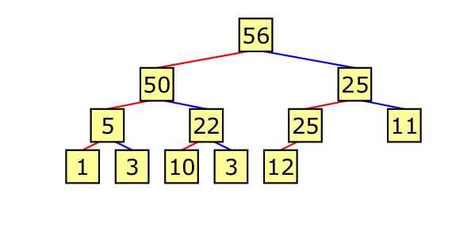
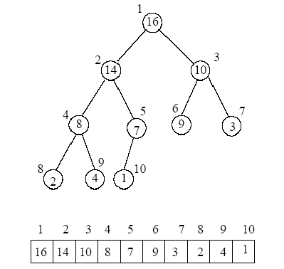

.. include:: <isopub.txt>

.. role:: kurt-code

Heap  and Priority Queues
=========================

Description
-----------

A heap is a complete binary tree, i.e., a binary tree in which nodes are added from left to the right until the level is complete, and in which no node has a key that is less than the key of either of its children. In a complete binary tree
the height of the left subtree is at most one more than the height of the right subtree. Unlike a binary search tree, in a heap the ordering of siblings is undetermined.

   **Figure 1. Logical Structure of a binary heap.** From: https://www.cs.uaf.edu/2009/spring/cs311/slides/cs311_20090417_heap_pq_stl.pdf

While a heap is a type of complete binary tree, it can be unique represented by storing its level order traversal in an array. In the array representation below, index zero is unoccupied, and the root is placed at index one. 

.. .. figure:: ../images/heap-nodes-numbered.jpg
..    :alt: Logical Structure 
..    :align: center 
..    :scale: 100 %
..    :figclass: custom-figure

..    **Figure 1. Numbering the Nodes of a Complete Binarya binary heap.** 

In the array representation of a heap no space is required for pointers; instead, the parent and children of each node can be found by simple arithmetic on array indices:

===================================== ==============================

===================================== ==============================
  Parent(i) = i/2                      returns position of parent
  Left(i)  = 2i                        returns left child position
  Right(i) = 2i + 1                    returns right child position
===================================== ==============================

If instead of one, we begin the array at index zero, the calculations for the position of a node's parent and its two children become:

===================================== ==============================

===================================== ==============================
  Parent(i) = (i-1)/2                  returns position of parent
  Left(i)  = 2i + 1                    returns left child position
  Right(i) = 2i + 2                    returns right child position
===================================== ==============================

.. todo:: Organize the remaining discussion after reading the bookmarked articles and understanding them and how they flow.

Max Heap Operations
-------------------

The abstract heap data type has three primary operatons:

1. **peekTop()**  
2. **add(int priority, const T& t)** 
3. **remove()**

**peekTop()** retrieve the root of the tree. **add(int priority, const T& t)** adds a new node to the end of the heap, which then "trickles up" to its position in the ordering. **remove()**  deletes the root and reheapifyies array by making the last
item the root, and then moving in downward until we again have a value heap.  

Code of Array Implementation of Max Heap
----------------------------------------

**add(int priority, const T& t)** Code 
~~~~~~~~~~~~~~~~~~~~~~~~~~~~~~~~~~~~~~

Pseudocode for Adding an Element to Max Heap:

1. Place the new element in the heap in the last location. 
2. Repair the heap ordering by swapping the element with its parent(s) as long as the new element has the greater value.

C++ Code
--------

The C++ implementation uses a functor to do the comparison operation. This allows the same code to be used for both a max heap and a min heap.

.. code-block:: cpp

    template<class T, class Comp=std::less<int> > class heap;  // forward declaration
    
    template<class T> class max_heap : public heap<T>  {};     // max_heap
    template<class T> class min_heap : public heap<T, std::greater<T>>  {};  // min_heap
    
    template<class T, class Comp> class heap {
      
        class Node {
         // snip...
        };        
    
        std::vector<Node> vec;
        Comp compare_functor;
        
        int size;
    
        bool compare(const Node& lhs, const Node& rhs)
        {
           return compare_functor(lhs.getPriority(), rhs.getPriority());		
        }	
    
       heap(int sz) : vec(sz), size{0} {}
    
       heap() : vec(), size{0} {}
    
       // snip....
     };

add(int priority, const T& data)
~~~~~~~~~~~~~~~~~~~~~~~~~~~~~~~~

Add places the new item at the end of the heap, and then swaps it with its parent until the heap property is re-established, i.e., the parent is not less than either of its children (in the case of a max heap).

.. code-block:: cpp

  template<class T, class Comp> void heap<T, Comp>::add(int x, const T& t)
  {
      ++size;
  
      vec.push_back(Node(x, t)); 
  
      int index = vec.size() - 1;
  
      swim(index); // repair heap property
  }
  
  template<class T, class Comp> void heap<T, Comp>::swim(int index)
  {
      // Move new item up until we have a valid heap
      int parentIndex;
  
      while (index > 0) { 
  
          parentIndex = (index - 1) / 2;
          
         if (compare(vec[index], vec[parentIndex])) {
         
             break; 
  
          }  else {        
  
             std::swap(vec[index], vec[parentIndex]);
  
             index = parentIndex;
          }
      }
  }
  
**remove()** Code 
~~~~~~~~~~~~~~~~~

Removes the root. Places the last item in the heap as the root, and the repair the heap property by invoking `sink(int index)`, which recursively swaps the new root with its largest child, as long 
as the largest child is larger than the root or until the root has become a leaf.

.. code-block:: cpp

  template<class T, class Comp> bool heap<T, Comp>::remove()
  {
     if (vec.empty()) {
  
         return false;
     }
  
     --size;
       
     // put last item in root
     vec[0] = vec[vec.size() - 1];
             
     vec.pop_back(); // then remove the formerly last item
  
     sink(0);  // repair heap property
  
     return true;
  }
  
  template<class T, class Comp> inline void heap<T, Comp>::sink(int root)
  {
    int child = 2 * root + 1; // Determine if root is a leaf.
  
    if (child < vec.size()) {  // If root is not a leaf, get the index of its largest child, either left or right
  
       int right_child = child + 1; 
  
        // When max heap, if root is smaller than largest child, swap root with that child.
        // When min heap, if root is larger than its smallest child, swap root with that child.
       if (compare(vec[child], vec[right_child])) {
              
             child = right_child; 
        }
  
        if (compare(vec[root], vec[child])) {
  
             std::swap(vec[root], vec[child]); 
  
             // ... and continue the process 
             sink(child);
        }  
    }
  }

C++ Implementation
~~~~~~~~~~~~~~~~~~

.. code-block:: cpp

    #include <iosfwd>
    #include <ostream>
    #include <iostream>
    #include <iterator>
    #include <algorithm>
    #include <vector>
    #include <queue>
    #include <exception>
    #include <cmath>
    #include <utility>
    #include <memory>
    
    /*
     * Generic heaps that works as max heap and min heap. i.e., 
     */
    
    template<class T, class Comp=std::less<int> > class heap; 
    template<class T> class max_heap : public heap<T>  {}; 
    template<class T> class min_heap : public heap<T, std::greater<T>>  {}; 
    
    template<class T, class Comp> class heap {
      
        class Node {
            
            friend class heap<T, Comp>;
    
            union {
               std::pair<int, T> pair;
               std::pair<const int, T> constkey_pair;
            };
           
            constexpr const std::pair<const int, T>& getPair() const noexcept
            { 
              return constkey_pair; 
            } 
    
            constexpr std::pair<const int, T>& getPair() noexcept
            { 
              return constkey_pair; 
            }
    
          public: 
                   
            Node(int priority, const T& t) : pair{priority, t} {}
    
            Node(int priority, T&& t) : pair{priority, std::move(t)} {}
    
            Node(const Node& n) : pair{n.pair}
            {
            }
            
            Node(Node&& node) : pair{std::move(node.pair)} 
            {
            }
    
            Node& operator=(const Node& n);
            
            Node& operator=(Node&& n);
             
            const T& getData() const 
            { 
                return pair.second; 
            }
             
            T& getData() noexcept
            { 
                return pair.second; 
            }
    
            int getPriority() const noexcept 
            { 
                return pair.first; 
            } 
           
            friend bool operator<(const Node& lhs, const Node& rhs)
            { 
                return lhs.getPriority() < rhs.getPriority();
            }
            
            friend bool operator>(const Node& lhs, const Node& rhs)
            {
                return lhs.getPriority() > rhs.getPriority(); 
            }    
    
            std::ostream& print(std::ostream& ostr) const noexcept
            {          
              return  ostr << '[' << getPriority() << ", " << getData() << ']' << std::flush;
            } 
    
            friend std::ostream& operator<<(std::ostream& ostr, const Node& node)
            {
                return node.print(ostr);
            }
        };
    
        std::vector<Node> vec;
        Comp compare_functor;
        
        int size;
    
        bool compare(const Node& lhs, const Node& rhs)
        {
           return compare_functor(lhs.getPriority(), rhs.getPriority());		
        }	
    
        /* 
         * bottom-up repair of heap property ("swim up"). Continues to swap the value in index pos with the parent until parent is not less than vec[pos].
         * until we again have a valid heap. 
         */ 
        void swim(int pos); 
        
        /*
         * top-down reheapify. Move the value in index pos downward ("sink down"), if necessary, until we again 
         * have a valid heap        
         */
        void sink(int pos); 
    
        int parent(int pos) const noexcept
        {
           return (pos - 1) / 2; 
        }
    
        int leftChild(int pos) const noexcept
        {
           return 2 * pos + 1;
        }
    
        int rightChild(int pos) const noexcept
        {
           return 2 * pos + 2;
        }
    
        bool is_leaf(int pos) const noexcept 
        { 
           return leftChild(pos) >= vec.size() ? true : false; 
        }  
    
        public:   
    
         using value_type = std::pair<const int, T>; 
         using reference = std::pair<const int, T>&; 
       
         heap(int size);
         heap();
         
         bool isEmpty() const;
         
         T peekTop() const;
         
         void add(int priority, const T& t);
         
         bool remove();
         
         void clear();
         
         int height() const noexcept;
         
         void print_heap(std::ostream&) const noexcept; 
    
         void print_heap_priorities(std::ostream&) const noexcept; 
    
         void show_level(int height, int level, std::ostream& ostr) const noexcept; 
    
         friend std::ostream&  operator<<(std::ostream&  ostr, const heap& lhs_heap) 
         {
             lhs_heap.print_heap(ostr);
             return ostr;
         }
    
         class iterator : public std::iterator<std::bidirectional_iterator_tag, typename heap<T, Comp>::value_type> { 
                                                     
           friend class heap;   
    
          private:
    
             typename std::vector<Node>::iterator iter; 
    
             iterator& increment() noexcept; 
    
             iterator(heap& lhs, int i) : iter{lhs.vec.end()} 
             {
    
             }
             
             typename heap<T, Comp>::reference dereference() const noexcept
             {
                 return iter->getPair();
             }
            
          public:
    
             explicit iterator(heap& lhs) : iter{lhs.vec.begin()} 
             {
             }   
    
             iterator(const iterator& lhs) : iter{lhs.iter}
             {
             }
    
             iterator(iterator&& lhs); 
     
             bool operator==(const iterator& lhs) const
             {
                return iter == lhs.iter; 
             } 
             
             constexpr bool operator!=(const iterator& lhs) const { return !operator==(lhs); }
    
             constexpr std::pair<const int, T>& operator*() noexcept 
             { 
                return this->dereference();
             }
             
             iterator& operator++() noexcept
             {
               ++iter; 
               return *this; 
             }  
    
             iterator operator++(int) noexcept
             {
               iterator tmp{*this};
               
               operator++(); 
    
               return tmp; 
             }  
     
             iterator& operator--() noexcept
             {
               --iter; 
               return *this; 
             }  
    
             iterator operator--(int) noexcept
             {
               iterator tmp{*this};
               
               operator--(); 
    
               return tmp; 
             }  
    
             constexpr std::pair<const int, T>  *operator->() noexcept
             {
                &operator*(); 
             }
    
        };
    
       class const_iterator : public std::iterator<std::bidirectional_iterator_tag, const value_type> {                                                  
    
           friend class heap;   
    
          private:
    
             typename std::vector<Node>::const_iterator iter; 
    
             const_iterator(const heap& lhs, int i) : iter{lhs.vec.end()} 
             {
    
             }
             
             const typename heap<T, Comp>::value_type& dereference() const noexcept
             {
                 return iter->getPair();
             }
            
          public:
    
             explicit const_iterator(const heap& lhs) : iter{lhs.vec.begin()} 
             {
             }   
    
             const_iterator(const const_iterator& lhs) : iter{lhs.iter}
             {
             }
    
             const_iterator(iterator&& lhs); 
     
             bool operator==(const const_iterator& lhs) const
             {
                return iter == lhs.iter; 
             } 
             
             constexpr bool operator!=(const const_iterator& lhs) const { return !operator==(lhs); }
    
             constexpr const std::pair<const int, T>& operator*() noexcept 
             { 
                return this->dereference();
             }
             
             const_iterator& operator++() noexcept
             {
               ++iter; 
               return *this; 
             }  
    
             const_iterator operator++(int) noexcept
             {
               const_iterator tmp{*this};
               
               operator++(); 
    
               return tmp; 
             }  
     
             const_iterator& operator--() noexcept
             {
               --iter; 
               return *this; 
             }  
    
             const_iterator operator--(int) noexcept
             {
               const_iterator tmp{*this};
               
               operator--(); 
    
               return tmp; 
             }  
    
             constexpr std::pair<const int, T>  *operator->() noexcept
             {
                &operator*(); 
             }
        };     
    
        iterator begin() noexcept;  
        iterator end() noexcept;  
    
        const_iterator begin() const noexcept;  
        const_iterator end() const noexcept;  
    };
    
    template<class T, class Comp> typename heap<T, Comp>::Node& heap<T, Comp>::Node::operator=(const typename heap<T, Comp>::Node& n)
    {
       if (this != &n) { 
        
            pair = n.pair;           
       } 
       return *this;
    }       
    
    template<class T, class Comp> typename heap<T, Comp>::Node& heap<T, Comp>::Node::operator=(typename heap<T, Comp>::Node&& n)
    {
       if (this != &n) { 
    
            pair = std::move(n.pair);       
        } 
        return *this;
    }       
    
    template<class T, class Comp> inline bool heap<T, Comp>::isEmpty() const
    {
      return vec.size() == 0;
    }
    
    template<class T, class Comp> T heap<T, Comp>::peekTop() const
    {
       if (vec.size() > 0) {
    
          return vec[0].getData();
    
       } else {
       
          throw std::logic_error(std::string("peekTop() called on empty heap"));
       }
    }
    
    template<class T, class Comp> inline heap<T, Comp>::heap(int sz) : vec(sz), size{0} 
    {
    }
    
    template<class T, class Comp> inline heap<T, Comp>::heap() : vec(), size{0}
    {
    }
    
    
    template<class T, class Comp> void heap<T, Comp>::add(int x, const T& t)
    {
        ++size;
    
        vec.push_back(Node(x, t)); 
    
        int index = vec.size() - 1;
    
        swim(index); // repair heap property
    }
    
    template<class T, class Comp> void heap<T, Comp>::swim(int index)
    {
        // Move new item up until we have a valid heap
        int parentIndex;
    
        while (index > 0) { 
    
            parentIndex = (index - 1) / 2;
            
           if (compare(vec[index], vec[parentIndex])) {
           
               break; 
    
            }  else {        
    
               std::swap(vec[index], vec[parentIndex]);
    
               index = parentIndex;
            }
        }
    }
    
    template<class T, class Comp> bool heap<T, Comp>::remove()
    {
       if (vec.empty()) {
    
           return false;
       }
    
       --size;
         
       // put last item in root
       vec[0] = vec[vec.size() - 1];
               
       vec.pop_back(); // then remove the formerly last item
    
       sink(0);  // repair heap property
    
       return true;
    }
    /*
     * Move the new root downward until we have a valid heap.
     */
     
    template<class T, class Comp> inline void heap<T, Comp>::sink(int root)
    {
      int child = 2 * root + 1; // Determine if root is a leaf.
    
      if (child < vec.size()) {  // If root is not a leaf, get the index of its largest child, either left or right
    
         int right_child = child + 1; 
    
         if (compare(vec[child], vec[right_child])) {
                
               child = right_child; 
          }
    
          // If root smaller than right child, swap root with larger child...
          if (compare(vec[root], vec[child])) {
    
               std::swap(vec[root], vec[child]); 
    
               // ... and continue the process 
               sink(child);
          }  
      }
    }
    
    template<typename T, typename Comp> int  heap<T, Comp>::height() const noexcept
    {
       if (size == 0) return 0;
    
       return static_cast<int>(std::log2(size + 1));  
    }
    
    template<typename T, typename Comp> void heap<T, Comp>::print_heap(std::ostream& ostr) const noexcept
    {
       if (size == 0) return;
    
       int tree_height = height(); 
      
       auto level = 0;
    
       int pos = 0;
      
       while (pos < size) {
     
            int tree_level = static_cast<int>(log2(pos + 1) + 1);
    
            if (level != tree_level) {
    
               level = tree_level;
    
               show_level(tree_height, level, ostr);  
            }  
                    
            ostr << vec[pos] << "  ";
            
            ++pos;
       }
    }
    
    template<typename T, typename Comp> void heap<T, Comp>::print_heap_priorities(std::ostream& ostr) const noexcept
    {
       if (size == 0) return;
    
       int tree_height = height(); 
      
       auto level = 0;
    
       int pos = 0;
       
       for (auto iter = begin();iter != end(); ++iter) {
     
            int current_level = static_cast<int>(log2(pos++ + 1) + 1);
    
            if (level != current_level) {
    
               level = current_level;
    
               show_level(tree_height, level, ostr);  
            }  
                    
            auto& [priority, data ] = *iter;  // C++17 structured bindings  
    
            ostr << '[' << priority << "]  " << std::flush;
        }
    }
    
    template<class T, class Comp> void heap<T, Comp>::show_level(int height, int current_level, std::ostream& ostr) const noexcept
    {
      ostr << "\n\n" << "current_level = " <<  current_level << ' '; 
         
      // Provide some basic spacing to tree appearance.
      std::size_t num = height - current_level + 1;
      
      std::string str(num, ' ');
      
      ostr << str << std::flush; 
    } 
    
    
    template<class T, class Comp> inline typename heap<T, Comp>::iterator heap<T, Comp>::begin() noexcept
    {
      return iterator{*this};
    }
    
    template<class T, class Comp> inline typename heap<T, Comp>::iterator heap<T, Comp>::end() noexcept
    {
       return iterator{*this, 0};
    }
    
    template<class T, class Comp> inline typename heap<T, Comp>::const_iterator heap<T, Comp>::begin() const noexcept
    {
      return const_iterator{*this};
    }
    
    template<class T, class Comp> inline typename heap<T, Comp>::const_iterator heap<T, Comp>::end() const noexcept
    {
       return const_iterator{*this, 0};
    }
