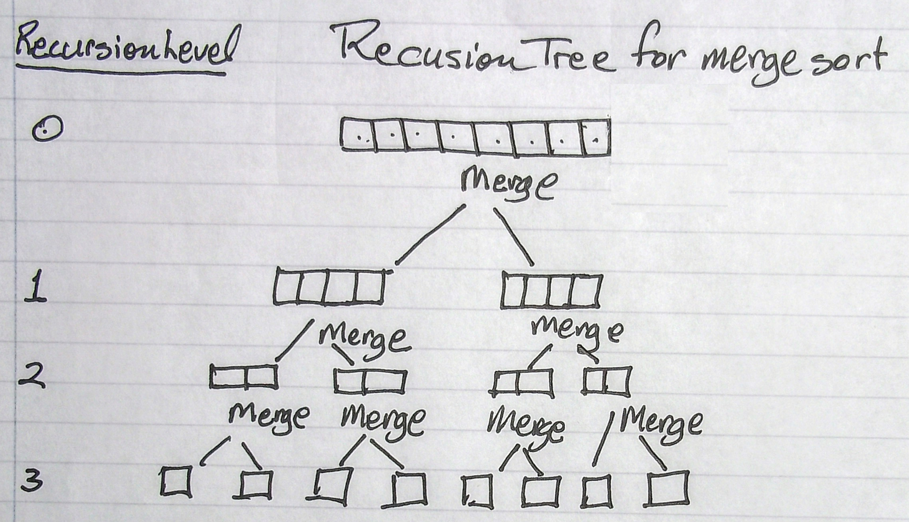

.. include:: <isopub.txt>

.. role:: kurt-code

Sorting
=======

Merge Sort
^^^^^^^^^^

Merge sort recursively divides an array into smaller subarrays until subarrays of size one are reached, which terminated the recursion. The merge of the subarrays (into sorted order) then
occurs.  The number of levels in the recursion is:

    1 + floor (log\ :sub:`2` N)

where N is the array size.  

Merge Sort Pseudocode
---------------------

Input sequence S with n elements, comparator C. S is sorted in ascending sequence:

.. raw:: html

   <pre>
   mergeSort(S, C)
   {
       if S.size() > 1 {
   
           (S1, S2) <-- partition(S, n/2) 
           mergeSort(S1, C)
           mergeSort(S2, C)
           S <--merge(S1, S2)
       }
   }
   </pre>

First implementation
--------------------

This implementation assumes the input is an array. A temporary working buffer the same size as the input array is first allocated, which is used in the merge (the conquer) step. After the buffer
is allocated the recursive subdivision of the array begins. When an array of size one is encountered, the recursion stops, and the merge step occurs.

.. code-block:: cpp
 
   #ifndef GERNEIC_MERGE_SORT_H
   #define GERNEIC_MERGE_SORT_H
   #include <memory>
   
   template<typename T, typename Comparator> static void do_merge(T *a, int first, int mid, int last, T *buffer, Comparator C);
   template<typename T, typename Comparator> static void do_merge_sort(T *a, int first, int last, T *buffer, Comparator C);
   
   template<typename T, typename Comparator> void merge_sort(T *a, int first, int last, Comparator C)
   {
       // allocate a working buffer for our merges
       std::unique_ptr<T[]> work_buffer { new T[last + 1 - first] };
      
       do_merge_sort<T, Comparator>(a, first, last, work_buffer, C);
   }
   
   template<typename T, typename Comparator> static void do_merge_sort(T *a, int first, int last, T *buffer, Comparator C)
   {
       // base case: the range [first, last] can no longer be subdivided.
       if (first < last) {
           
           int mid = (first + last) / 2; // index of mid point
           
           do_merge_sort<T, Comparator>(a, first, mid, buffer, C);    // sort left half
           do_merge_sort<T, Comparator>(a, mid + 1, last, buffer, C); // sort right half
           
           // merge the two halves
           do_merge<T, Comparator>(a, first, mid, last, buffer, C);
       }
   }
   
   template<typename T, typename Comparator> static void do_merge(T *a, int first, int mid, int last, T *buffer, Comparator compare)
   {
       int first1 = first;
       int last1 = mid;
       int first2 = mid + 1;
       int last2 = last;
       
       int index = 0;
       /* 
        * While both sub-arrays are not empty, copy the smaller item into the 
        * temporary array buffer.
        */
       for (; first1 <= last1 && first2 <= last2; ++index) {
           
           if ( compare(a[first1], a[first2]) ) {
               
               buffer[index] = std::move(a[first1]);
               first1++;
   
           } else {
               
               buffer[index] = std::move(a[first2]);
               first2++;
           }
       }
       
       // finish off the first sub-array, if necessary
       for (;first1 <= last1; first1++, index++) {
           
           buffer[index] = std::move(a[first1]);
       }
       
       // finish off the second sub-array, if necessary
       for (;first2 <= last2; first2++, index++) {
           
           buffer[index] = std::move(a[first2]);
       }
            
      // copy the temp array to the original array
      int length = last + 1 - first;
       
       for (index = 0; index < length; ++index) {
           
           a[first++] = std::move(buffer[index]);
       }
   }
   #endif

A more Generic Implementaion
----------------------------

This implementation does not require the data structure being sorted to be an array. It only requires an generic random access iterator type with pointer-like semantics such as
addition and substraction with an integer, subtraction of two iterators, deferencing and comparison. 

.. code-block:: cpp

   #ifndef GERNEIC_MERGE_SORT_H
   #define GERNEIC_MERGE_SORT_H
   
   
   template<typename Iterator, typename Comparator> static void do_merge(Iterator  first, Iterator  mid,
           Iterator  last,
           Iterator  buffer_start,
           Comparator C);
   
   template<typename Iterator, typename Comparator> static void do_merge_sort(Iterator  first, Iterator  last,
                                                                     Iterator  buffer, Comparator C);
   
   template<typename T, typename Iterator,  typename Comparator> void merge_sort(Iterator first, Iterator last, Comparator C)
   {
      // allocate a working buffer for our merges
      std::unique_ptr<T[]> work_buffer { std::make_unqiue(last + 1 - first) };
       
      do_merge_sort(first, last, work_buffer, C);
   }
   
   template<typename Iterator, typename Comparator> static void do_merge_sort(Iterator  first, Iterator  last,
                                                                     Iterator  buffer, Comparator c) 
   {
       // base case: the range [first, last] can no longer be subdivided.
       if (first < last) {
           
           int mid = (last - first) / 2; // index of mid point
           
           Iterator  mid_iterator = first + mid;
           Iterator  mid_iterator_plus1 = mid_iterator + 1;
           
           do_merge_sort(first, mid_iterator, buffer, c);    // sort left half
            
           do_merge_sort(mid_iterator_plus1, last, buffer, c); // sort right half
           
           // merge the two halves
           do_merge(first, mid_iterator, last, buffer, c);
       }
   }
   
   template<typename Iterator,  typename Comparator> static void do_merge(Iterator  first, Iterator  mid, Iterator  last,
                                                                     Iterator  buffer_start, Comparator compare)
   {
       Iterator  first1 = first;
       Iterator  last1 = mid;
       
       Iterator  first2 = mid + 1;
       Iterator  last2 = last;
           
       int index = 0;
       
       /* 
        * While both sub-arrays are not empty, copy the smaller item into the 
        * temporary array buffer.
        */
       Iterator  buffer_cursor = buffer_start;
       
       for (; first1 <= last1 && first2 <= last2; ++buffer_cursor) {
           
           if ( compare(*first1, *first2) ) {
               
               *buffer_cursor = std::move(*first1++);
   
           } else {
               
               *buffer_cursor = *std::move(first2++);
           }
       }
       
       // finish off the first sub-array, if necessary
       for (;first1 <= last1; ++first1, ++buffer_cursor) {
           
           *buffer_cursor = *std::move(first1);
       }
       
       // finish off the second sub-array, if necessary
       for (;first2 <= last2; ++first2, ++buffer_cursor) {
           
           *buffer_cursor = *std::move(first2);
       }
            
      // copy the temp array to the original array
      int length = last + 1 - first;
      Iterator  start = buffer_start;
      
       for (Iterator  end = start + length; start != end; ++start) {
           
           *first++ = *std::move(start);
       }
   }
   #endif

Animating the Algorithm
-----------------------

To illustrate how the algorithm worksm, recursively descends until it finally encounters the base case, and how it repeatly invokes merge as he recursion unwinds, we display 
the input of each call of merge_sort, noting the section of the input data structure currently being subdivided. We also show the input and output of the merge step.

.. code-block:: cpp

   #include <string>
   #include <iostream>
   #include <functional>
   #include <iterator>
   #include <algorithm>
   #include <map>
   #include <memory>
   
   namespace algolib {
   
   class Animator { 
     public:    
       enum section {all, left, right };
       template<typename Iterator> static void print_stdout(Iterator first, Iterator last, int depth,
                                                            Animator::section s, std::string suffix = std::string{}) noexcept;
     private:
       static  std::map<section, std::string> mapping;
   
       static std::string get_string(section s)
       {
          return Animator::mapping[s];
       } 
   };
          
   std::map<Animator::section, std::string>  Animator::mapping { {all, std::string("  all")}, 
                            {left, std::string(" left")},
                            {right, std::string("right")}
                               };
                               
   template<typename Iterator> void Animator::print_stdout(Iterator first, Iterator last, int depth, Animator::section sec, std::string suffix) noexcept
   {
     std::string part = Animator::get_string(sec);
   
     std::cout << "At depth " << depth << ". Section:  " << part << ": ";
       
     // Since last is the actual last element (and not one pass it), we  add one because copy() requires "one past".                          
     std::copy(first, last + 1, std::ostream_iterator<decltype(*first)>(std::cout, " "));
           
     std::cout << suffix << std::endl;
   }
   
   /*
    * Parameter end must be one past the actual end.
    */
   template<typename Iterator> void print_array(Iterator start, Iterator end) noexcept
   {
       // print out merged array
       std::cout << std::string(" [ "); 
               
       std::copy(start, end, std::ostream_iterator<decltype(*start)>(std::cout, " "));
   
       std::cout << std::string("] "); 
   }
   
   template<typename Iterator, typename Comparator> static void merge(Iterator first, Iterator mid, Iterator last,
           Iterator buffer_start,
           Comparator C, int depth) noexcept;
   
   // merge_sort() is overloaded
   template<typename T, typename Iterator, typename Comparator> void merge_sort(Iterator first, Iterator last, Comparator c) noexcept;
   
   template<typename Iterator, typename Comparator> static void merge_sort(Iterator first, Iterator last,
                                                                     Iterator buffer, Comparator C, int depth = 0, Animator::section sec = Animator::all) noexcept;
   
   template<typename T, typename Iterator, typename Comparator> void merge_sort(Iterator first, Iterator last, Comparator c) noexcept
   {
      // allocate a working buffer for our merges
      auto length = last + 1 - first;    //<-- Note: this requires a random access iterator
   
      std::unique_ptr<T[]> temp_array { new T[length] };  
   
      merge_sort(first, last, temp_array.get(), c);
   }
   
   //} // end namespace algolib
   
   template<typename Iterator, typename Comparator> static void merge_sort(Iterator first, Iterator last,
                                                                     Iterator buffer, Comparator c, int depth, Animator::section sec) noexcept 
   {
   static Iterator orig_data_struct_first;
   static Iterator orig_data_struct_last;
   
     if (depth == 0) {
   
       orig_data_struct_first = first;
       orig_data_struct_last = last;
   
     } 
   
     // base case: the range [first, last] can no longer be subdivided.
     if (first < last) {
   
         Animator::print_stdout(first, last, depth, sec);
   
         /*
          * 1. Divide data structure in a left, first half and second or right half.
          */ 
         int half_distance = (last - first) / 2; // distance to mid point
           
         Iterator mid = first + half_distance;
   
         // recursively subdivide left half
         algolib::merge_sort(first, mid, buffer, c, depth + 1, Animator::section::left);    
   
         // when left half recursion end, recursively subdivide right half (of prior array on stack).
         algolib::merge_sort(mid + 1, last, buffer, c, depth + 1, Animator::section::right);
         
         // merge the two halves
         algolib::merge(first, mid, last, buffer, c, depth);
         
         // print the result of the merge
         print_array(first, last + 1); 
         
         std::cout << std::endl;
         
     } else {
   
         Animator::print_stdout(first, last, depth, sec, std::string(" <-- Recursion ends."));
     }
   }
   
   template<typename Iterator, typename Comparator> static void merge(Iterator first, Iterator mid, Iterator last,
                                                                     Iterator buffer_start, Comparator compare, int depth) noexcept
   {
       Iterator first1 = first;
       Iterator last1 = mid;
       
       Iterator first2 = mid + 1;
       Iterator last2 = last;
       
       /*
        * Print out input arrays to be merged....
        */
   
       std::cout << "Merging at depth " << depth << " : left half";
   
       print_array(first1, last1 +  1);
   
       std::cout << " right half";
   
       print_array(first2, last2 +  1);
   
       std::cout <<  std::string(" ---> "); // << "\n                    ";
   
       int index = 0;
       
       /* 
        * While both sub-arrays are not empty, copy the smaller item into the 
        * temporary array buffer.
        */
       Iterator buffer_cursor = buffer_start;
          
       for (; first1 <= last1 && first2 <= last2; ++buffer_cursor) {
           
           if ( compare(*first1, *first2) ) {
               
               *buffer_cursor = *first1++;
   
           } else {
               
               *buffer_cursor = *first2++;
           }
       }
       
       // finish off the first sub-array, if necessary
       for (;first1 <= last1; ++first1, ++buffer_cursor) {
           
           *buffer_cursor = *first1;
       }
       
       // finish off the second sub-array, if necessary
       for (;first2 <= last2; ++first2, ++buffer_cursor) {
           
           *buffer_cursor = *first2;
       }
              
       // copy the temp array to the original array
       int length = last + 1 - first;
       Iterator start = buffer_start;
   
       Iterator first_extra = first; 
   
       for (Iterator end = start + length; start != end;) {
           
           *first++ = *start++;
       }
   }
   
   } // end namespace algolib
   
If we run merge_sort now and pass it the array of integers { 32, 31, 30, 29, 28, 27, 26, 25, 24, 23, 22, 21, 20, 19, 18, 17, 16, 15, 14, 13, 12, 11, 10, 9, 8, 7, 6, 5, 4, 3, 2, 1 }, the animated output is:

.. raw:: html

    <pre>
   =============== Sort of std::array<int, 32> below ================
   At depth 0. Section:    all: 32 31 30 29 28 27 26 25 24 23 22 21 20 19 18 17 16 15 14 13 12 11 10 9 8 7 6 5 4 3 2 1 
   At depth 1. Section:   left: 32 31 30 29 28 27 26 25 24 23 22 21 20 19 18 17 
   At depth 2. Section:   left: 32 31 30 29 28 27 26 25 
   At depth 3. Section:   left: 32 31 30 29 
   At depth 4. Section:   left: 32 31 
   At depth 5. Section:   left: 32  <-- Recursion ends.
   At depth 5. Section:  right: 31  <-- Recursion ends.
   Merging at depth 4 : left half [ 32 ]  right half [ 31 ]  --->  [ 31 32 ] 
   At depth 4. Section:  right: 30 29 
   At depth 5. Section:   left: 30  <-- Recursion ends.
   At depth 5. Section:  right: 29  <-- Recursion ends.
   Merging at depth 4 : left half [ 30 ]  right half [ 29 ]  --->  [ 29 30 ] 
   Merging at depth 3 : left half [ 31 32 ]  right half [ 29 30 ]  --->  [ 29 30 31 32 ] 
   At depth 3. Section:  right: 28 27 26 25 
   At depth 4. Section:   left: 28 27 
   At depth 5. Section:   left: 28  <-- Recursion ends.
   At depth 5. Section:  right: 27  <-- Recursion ends.
   Merging at depth 4 : left half [ 28 ]  right half [ 27 ]  --->  [ 27 28 ] 
   At depth 4. Section:  right: 26 25 
   At depth 5. Section:   left: 26  <-- Recursion ends.
   At depth 5. Section:  right: 25  <-- Recursion ends.
   Merging at depth 4 : left half [ 26 ]  right half [ 25 ]  --->  [ 25 26 ] 
   Merging at depth 3 : left half [ 27 28 ]  right half [ 25 26 ]  --->  [ 25 26 27 28 ] 
   Merging at depth 2 : left half [ 29 30 31 32 ]  right half [ 25 26 27 28 ]  --->  [ 25 26 27 28 29 30 31 32 ] 
   At depth 2. Section:  right: 24 23 22 21 20 19 18 17 
   At depth 3. Section:   left: 24 23 22 21 
   At depth 4. Section:   left: 24 23 
   At depth 5. Section:   left: 24  <-- Recursion ends.
   At depth 5. Section:  right: 23  <-- Recursion ends.
   Merging at depth 4 : left half [ 24 ]  right half [ 23 ]  --->  [ 23 24 ] 
   At depth 4. Section:  right: 22 21 
   At depth 5. Section:   left: 22  <-- Recursion ends.
   At depth 5. Section:  right: 21  <-- Recursion ends.
   Merging at depth 4 : left half [ 22 ]  right half [ 21 ]  --->  [ 21 22 ] 
   Merging at depth 3 : left half [ 23 24 ]  right half [ 21 22 ]  --->  [ 21 22 23 24 ] 
   At depth 3. Section:  right: 20 19 18 17 
   At depth 4. Section:   left: 20 19 
   At depth 5. Section:   left: 20  <-- Recursion ends.
   At depth 5. Section:  right: 19  <-- Recursion ends.
   Merging at depth 4 : left half [ 20 ]  right half [ 19 ]  --->  [ 19 20 ] 
   At depth 4. Section:  right: 18 17 
   At depth 5. Section:   left: 18  <-- Recursion ends.
   At depth 5. Section:  right: 17  <-- Recursion ends.
   Merging at depth 4 : left half [ 18 ]  right half [ 17 ]  --->  [ 17 18 ] 
   Merging at depth 3 : left half [ 19 20 ]  right half [ 17 18 ]  --->  [ 17 18 19 20 ] 
   Merging at depth 2 : left half [ 21 22 23 24 ]  right half [ 17 18 19 20 ]  --->  [ 17 18 19 20 21 22 23 24 ] 
   Merging at depth 1 : left half [ 25 26 27 28 29 30 31 32 ]  right half [ 17 18 19 20 21 22 23 24 ]  --->  [ 17 18 19 20 21 22 23 24 25 26 27 28 29 30 31 32 ] 
   At depth 1. Section:  right: 16 15 14 13 12 11 10 9 8 7 6 5 4 3 2 1 
   At depth 2. Section:   left: 16 15 14 13 12 11 10 9 
   At depth 3. Section:   left: 16 15 14 13 
   At depth 4. Section:   left: 16 15 
   At depth 5. Section:   left: 16  <-- Recursion ends.
   At depth 5. Section:  right: 15  <-- Recursion ends.
   Merging at depth 4 : left half [ 16 ]  right half [ 15 ]  --->  [ 15 16 ] 
   At depth 4. Section:  right: 14 13 
   At depth 5. Section:   left: 14  <-- Recursion ends.
   At depth 5. Section:  right: 13  <-- Recursion ends.
   Merging at depth 4 : left half [ 14 ]  right half [ 13 ]  --->  [ 13 14 ] 
   Merging at depth 3 : left half [ 15 16 ]  right half [ 13 14 ]  --->  [ 13 14 15 16 ] 
   At depth 3. Section:  right: 12 11 10 9 
   At depth 4. Section:   left: 12 11 
   At depth 5. Section:   left: 12  <-- Recursion ends.
   At depth 5. Section:  right: 11  <-- Recursion ends.
   Merging at depth 4 : left half [ 12 ]  right half [ 11 ]  --->  [ 11 12 ] 
   At depth 4. Section:  right: 10 9 
   At depth 5. Section:   left: 10  <-- Recursion ends.
   At depth 5. Section:  right: 9  <-- Recursion ends.
   Merging at depth 4 : left half [ 10 ]  right half [ 9 ]  --->  [ 9 10 ] 
   Merging at depth 3 : left half [ 11 12 ]  right half [ 9 10 ]  --->  [ 9 10 11 12 ] 
   Merging at depth 2 : left half [ 13 14 15 16 ]  right half [ 9 10 11 12 ]  --->  [ 9 10 11 12 13 14 15 16 ] 
   At depth 2. Section:  right: 8 7 6 5 4 3 2 1 
   At depth 3. Section:   left: 8 7 6 5 
   At depth 4. Section:   left: 8 7 
   At depth 5. Section:   left: 8  <-- Recursion ends.
   At depth 5. Section:  right: 7  <-- Recursion ends.
   Merging at depth 4 : left half [ 8 ]  right half [ 7 ]  --->  [ 7 8 ] 
   At depth 4. Section:  right: 6 5 
   At depth 5. Section:   left: 6  <-- Recursion ends.
   At depth 5. Section:  right: 5  <-- Recursion ends.
   Merging at depth 4 : left half [ 6 ]  right half [ 5 ]  --->  [ 5 6 ] 
   Merging at depth 3 : left half [ 7 8 ]  right half [ 5 6 ]  --->  [ 5 6 7 8 ] 
   At depth 3. Section:  right: 4 3 2 1 
   At depth 4. Section:   left: 4 3 
   At depth 5. Section:   left: 4  <-- Recursion ends.
   At depth 5. Section:  right: 3  <-- Recursion ends.
   Merging at depth 4 : left half [ 4 ]  right half [ 3 ]  --->  [ 3 4 ] 
   At depth 4. Section:  right: 2 1 
   At depth 5. Section:   left: 2  <-- Recursion ends.
   At depth 5. Section:  right: 1  <-- Recursion ends.
   Merging at depth 4 : left half [ 2 ]  right half [ 1 ]  --->  [ 1 2 ] 
   Merging at depth 3 : left half [ 3 4 ]  right half [ 1 2 ]  --->  [ 1 2 3 4 ] 
   Merging at depth 2 : left half [ 5 6 7 8 ]  right half [ 1 2 3 4 ]  --->  [ 1 2 3 4 5 6 7 8 ] 
   Merging at depth 1 : left half [ 9 10 11 12 13 14 15 16 ]  right half [ 1 2 3 4 5 6 7 8 ]  --->  [ 1 2 3 4 5 6 7 8 9 10 11 12 13 14 15 16 ] 
   Merging at depth 0 : left half [ 17 18 19 20 21 22 23 24 25 26 27 28 29 30 31 32 ]  right half [ 1 2 3 4 5 6 7 8 9 10 11 12 13 14 15 16 ]  --->  [ 1 2 3 4 5 6 7 8 9 10 11 12 13 14 15 16 17 18 19 20 21 22 23 24 25 26 27 28 29 30 31 32 ] 
   
   Output of merge sort: 
   1, 2, 3, 4, 5, 6, 7, 8, 9, 10, 11, 12, 13, 14, 15, 16, 17, 18, 19, 20, 21, 22, 23, 24, 25, 26, 27, 28, 29, 30, 31, 32, 
   </pre>

What does Recusion buy us?
--------------------------

What does Recusion buy us? Recursion depends upon the fact that the there is a built-in last-in-first-out stack that contains the state of all prior invocations of the
function. Therefore all local variable will have the same values they had before merge_sort is invoked within merge_sort. Furthermore, as the recursion ascends, the
merge step works on the results of prior merges.

An iterative version
~~~~~~~~~~~~~~~~~~~~

An non-recursive version can be easily implemented once we first realize that we do not need to replicate the merge steps in precisely the exact same order in they occur in the recursive version.
The recursive version the first half of the input is divided and conquered before the second half. But the merge step always involves merging adjacent subarrays. 

In the iterative algortihm we can therefore traverse the entire array repeatedly from beginning to end and during each traverse merge subarrays of increasing powers of two,
starting with all adjacent subarrays of size one. An illustrated explanation is at http://www.mathcs.emory.edu/~cheung/Courses/171/Syllabus/7-Sort/merge-sort5.html

Iterative Implementation
------------------------

This version is based on the java code at http://www.sinbadsoft.com/blog/a-recursive-and-iterative-merge-sort-implementations/.

.. code-block:: cpp

    #include <algorithm>
    /*
     * Iterative version of Merge Sort 
     * ===============================
     *
     * C++11 converiont this java code: http://www.sinbadsoft.com/blog/a-recursive-and-iterative-merge-sort-implementations/
    */
    // Fwd ref.
    template<typename T, typename Iterator, typename Comparator > static void iter_merge(Iterator first, int start, int middle, int end, Comparator comparer,
                                  T *work_buffer); 
    
    template<typename T, typename Iterator, typename Comparator> Iterator iter_merge_sort(Iterator first, Iterator last, Comparator comparer)
    {
        auto length = last + 1 - first;
    
        T *work_buffer = new T[length]; 
    
        /*
         * Traverse array input from beginning to end, sorting adjacent subarrays from the bottom up. Subarrays are always a power of 2 in size, starting 
         * with size one (2 to the zero), then 2 (2 to the first), 4 (2 to the second) and so on. The number of iterations is:
         * 
         *   log base 2(length) rounded up. 
         */
        for (int width = 1; width <= length / 2 + 1; width *= 2) {
            
            /*
             * merge adjacent subarrays of size width
             */  
    
            for (int start = width; start < length; start += 2 * width)  { // (2 * width) == sum of lengths of both subarrays.
    
                algolib::iter_merge(first, start - width, start, std::min<decltype(start)>(start + width, length), comparer, work_buffer); 
            }
        }
        
        delete [] work_buffer;
        
        return first;
    }
    
    template<typename T, typename Iterator, typename Comparator > static void iter_merge(Iterator input, int start, int middle, int end,
                                                                               Comparator comparer, T *work_buffer)
    {
        auto length = end - start;
    
        auto left = 0, right = 0, current = 0;
    
        while (left < middle - start && right < end - middle)     {
             
            if ( comparer(input[start + left], input[middle + right]) ) {
    
               work_buffer[current++] = input[start + left++];
    
            } else {  
    
                work_buffer[current++] = input[middle + right++];
    
            }
        }
     
        while (right < end - middle) {
    
             work_buffer[current++] = input[middle + right++];
        }
     
        while (left < middle - start) {
    
             work_buffer[current++] = input[start + left++];
        }
     
        std::copy(work_buffer, work_buffer + length, input + start); // copy to start
       
    }
    
    
    } // end namespace algolib
  
Total Work done?
----------------

If the total number of items in the two subarrays is N, the merge step involves at most N - 1 comparisions. In addition, there are N moves from the original array to the temporary array,
and N moves from the temporary array back to the original array. Therefore, each merge step requires (N - 1) + 2n or 3N - 1 operations.

What is the work done at a given level? The image blue shows a recursion tree, showing all the recursive calls, for an arry of size eight.

   **Figure 1. Recursion Tree for merge sort of array of size eight** 

In general, at a given level m, 2\ :sup:`m` calls to merge occur, and each call merges N/2\ :sup:`m` items. Using our 3N - 1 formula from above, the 2\ :sup:`m` calls to merge therefore require 

    2\ :sup:`m` * (3 * N/2\ :sup:`m`\  - 1) = 3N - 2\ :sup:`m` 

operations. This table shows the number of operations at each level of recursion for an array of size 8.

   **Figure 1. Operations a each level of recursion of merge sort**

In general, since there are 1 + floor(log\ :sub:`2` N) levels, the total number of opertions is 

    <= (1 + floor (log\ :sub:`2` N)) * 3N

which means the algorithm is O(N * log\ :sub:`2`\ N).

Application of Merge Sort: Counting Array Inversions
----------------------------------------------------

Definition of an Array Inversion:

    A inversion of an array **A** occurs whenever for a given pair of indecies i and j, i < j and **A[i]** > **A[j]**.

.. code-block:: cpp

    #include <algorithm>
    
    namespace algolib {
    
    /* forward references */
    
    template<typename T, typename Iterator, typename Comparator> int count_inversions(Iterator first, Iterator end, Comparator C);
    
    /* Iterator here is a random access iterator */
    template<typename Iterator, typename Comparator> static int merge_count_inversions(Iterator first, Iterator mid,
            Iterator last,
            Iterator buffer_start,
            Comparator C);
    
    template<typename Iterator, typename Comparator> static int merge_sort_count_inversions(Iterator first, Iterator last,
                                                                      Iterator work_buffer, Comparator c);
    
    
    template<typename T, typename Iterator, typename Comparator> int count_inversions(Iterator first, Iterator last, Comparator C)
    {
       /* allocate a working buffer for our merges */
       std::unique_ptr<T[]> work_buffer { new T[last + 1 - first] };
    
       int inversions = merge_sort_count_inversions(first, last, work_buffer, C);
    
       return inversions;
    }
    
    /* Returns number of array inversions */
    template<typename Iterator, typename Comparator> static int merge_sort_count_inversions(Iterator first, Iterator last,
                                                                      Iterator work_buffer, Comparator c)
    {
     int inversions = 0;
    
        // Base case: the range [first, last] can no longer be subdivided; it is of length one.
        if (first < last) {
    
            int half_distance = (last - first) / 2; 
            
            Iterator mid = first + half_distance;
    
            /* 
             * The variable inversions is a running total of the total number of inversions that occurs in each merge step, as we recursively
             * descend subdividing (first the right half and then the left) and then return and conquer by merging and counting inversions.
    
             * At the end of recursively subdividing the left half, we have a subarray of one element, the first value in the array. We
             * then return from subdividing the left half, and we recursively subdivide the right half of the previously-next-larger subarray, which is
             * of size two. This gives us the right-most element of the subarray of size two, consisting of the first two elements in the array.  
             * We then call merge_count_inversions(), which will be either one or zero.  
             *  
             */
            inversions = algolib::merge_sort_count_inversions(first, mid, work_buffer, c);
    
            inversions += algolib::merge_sort_count_inversions(mid + 1, last, work_buffer, c);
    
            inversions += algolib::merge_count_inversions(first, mid, last, work_buffer, c);
        }
    
        return inversions;
    }
    
    /*
     * Merges subarrays  [first, mid] and [mid + 1, last] into a sorted array in working buffer, buffer_start. Then copies
     * the working buffer over the original segement [first, last]
     */
    
    template<typename Iterator, typename Comparator> static int merge_count_inversions(Iterator first, Iterator mid, Iterator last,
                                                                      Iterator buffer_start, Comparator compare)
    {
     int inversions = 0;
    
        Iterator first1 = first;
        Iterator last1 = mid;
        
        Iterator first2 = mid + 1;
        Iterator last2 = last;
            
        int index = 0;
        
        /* 
         * While both sub-arrays are not empty, copy the smaller item into the 
         * temporary array buffer.
         */
        Iterator buffer_cursor = buffer_start;
        
        for (; first1 <= last1 && first2 <= last2; ++buffer_cursor) {
            
            if ( compare(*first1, *first2) ) {
                
                *buffer_cursor = *first1++; // not an inversion
    
            } else {
    
                // inversion found: element in first array is larger than element in second array.
                *buffer_cursor = *first2++;
    
      /* From: http://www.geeksforgeeks.org/counting-inversions/ 
       * How do we count the number of inversions in the merge step? In the merge process, if i is used for indexing left sub-array
       * and j for right sub-array. At any step in merge(), if a[i] is greater than a[j], then there are (mid – i) inversions, because
       * left and right subarrays are sorted, so all the remaining elements in left-subarray (a[i+1], a[i+2] … a[mid]) will be greater
       * than a[j].
       */  
                 inversions += (last1 + 1 - first1); 
            }
        }
        
        // finish off the first sub-array, if necessary
        for (;first1 <= last1; ++first1, ++buffer_cursor) {
            
            *buffer_cursor = *first1;
        }
    
        // finish off the second sub-array, if necessary
        for (;first2 <= last2; ++first2, ++buffer_cursor) {
            
            *buffer_cursor = *first2;
        }
             
       // Copy the temp array to the original array
       int length = last + 1 - first;
    
       Iterator start = buffer_start;
       
       for (Iterator end = start + length; start != end;) {
            
            *first++ = *start++;
       }
    
       return inversions;
    }
    
    } // end namespace algolib
