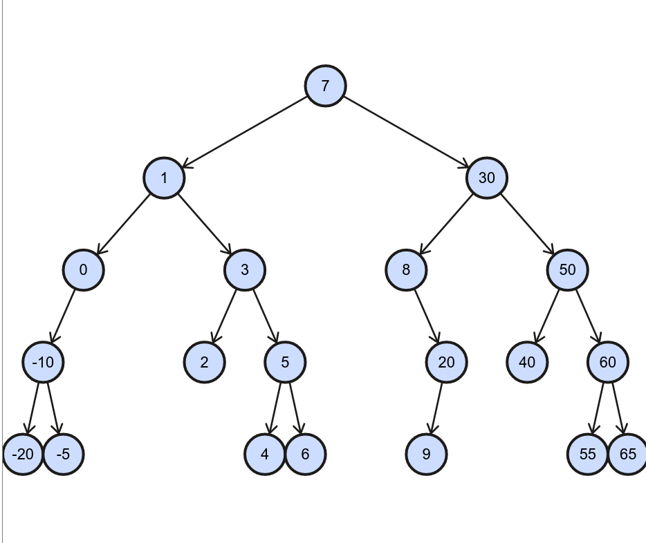

Pre Order
---------

Given this tree

The recursive pre-order algorithm visits the input node, initially the root, then recurses with its left child, and lastly recurses with its right child. This means left subtree is visited before the right subtree, and likewise each sub-subtree is visited before the left sub-subtree.
This ca been seen when the pre-order algorithm is called with the root of the above tree. 

.. raw:: html

    <pre>   
      7
      1
      0
    -10
    -20
     -5
      3
      2
      5
      4
      6
     30
      8
     20
      9
     50
     40
     60
     55
     54
     65
    </pre>   

The order in which nodes are visited is as just described, parent first, then left child, then right child.      

To create an iterative pre-order algorithm that mimics this behavior the root is pushed onto a stack, next a while-loop runs until the stack becomes empty. Inside the while-loop the stack is popped and visited. Next its right child, if it exists, is pushed onto the stack, followed by the
left child, if it exists. The right child is pushed onto the stack before the left child to ensure that the left child will be popped and visited before the right child. Once the left child is popped and visited, its right child, if it exists, is pushed onto the stack, followed by its
left child. 

By adding stack tracing logic to illustrate how the stack looks inside the beginning of the while-loop and how it looks at the end of the while-loop, when the just-visted node's children are pushed onto the stack. Thus the output of

.. code-block:: cpp

    template<class Key, class Value>
    template<typename Functor>
    void bstree<Key, Value>::preOrderIterative(Functor f, const std::unique_ptr<Node>& lhs) const noexcept
    {
     stack_tracer<Key> tracer; 
    
       if (!lhs) return;
      
        std::stack<const node_type *> stack; 
        stack.push(root.get()); 
      
        tracer.push(root->key());
    
        /*
          Pop all items one by one, and do the following for every popped item:
     
           a) invoke f 
           b) push its right child 
           c) push its left child 
    
        Note: the right child is pushed first so that left is processed first 
         */
        while (!stack.empty()) { 
    
            // Pop the top item from stack and print it 
            const node_type *node = stack.top(); 
            stack.pop(); 
    
            Key key = tracer.peek();
    
            std::cout << key << " is top of stack. Stack after pop() = ";
            tracer.pop();
            tracer.print();
           
            f(node->__get_value()); 
    
            // Push right and left non-null children of the popped node to stack 
            if (node->right) { 
                tracer.push(node->right->key());
                stack.push(node->right.get()); 
            }
    
            if (node->left) {
                tracer.push(node->left->key());
                stack.push(node->left.get()); 
            } 
            std::cout << "Stack after pushing children of " << key << " = ";
            tracer.print();
        } 
    }

is:

.. raw:: html

    <pre>   
    test_tree.preOrderIterative(key_printer) = 
    7 is top of stack. Stack after pop() = []          <-- root was pushed before while-loop, and popped and visited inside it, then its...
    Stack after pushing children of 7 = [1, 30, ]      <-- children are pushed onto the stack. The loop continues...   
    1 is top of stack. Stack after pop() = [30, ]      <--- 1 is popped and visited, and the process repeats, with its children being pushed onto the stack 
    Stack after pushing children of 1 = [0, 3, 30, ]
    0 is top of stack. Stack after pop() = [3, 30, ]
    Stack after pushing children of 0 = [-10, 3, 30, ]
    -10 is top of stack. Stack after pop() = [3, 30, ]
    Stack after pushing children of -10 = [-20, -5, 3, 30, ]
    -20 is top of stack. Stack after pop() = [-5, 3, 30, ]
    Stack after pushing children of -20 = [-5, 3, 30, ]
    -5 is top of stack. Stack after pop() = [3, 30, ]
    Stack after pushing children of -5 = [3, 30, ]
    3 is top of stack. Stack after pop() = [30, ]
    Stack after pushing children of 3 = [2, 5, 30, ]
    2 is top of stack. Stack after pop() = [5, 30, ]
    Stack after pushing children of 2 = [5, 30, ]
    5 is top of stack. Stack after pop() = [30, ]
    Stack after pushing children of 5 = [4, 6, 30, ]
    4 is top of stack. Stack after pop() = [6, 30, ]
    Stack after pushing children of 4 = [6, 30, ]
    6 is top of stack. Stack after pop() = [30, ]
    Stack after pushing children of 6 = [30, ]
    30 is top of stack. Stack after pop() = []
    Stack after pushing children of 30 = [8, 50, ]
    8 is top of stack. Stack after pop() = [50, ]
    Stack after pushing children of 8 = [20, 50, ]
    20 is top of stack. Stack after pop() = [50, ]
    Stack after pushing children of 20 = [9, 50, ]
    9 is top of stack. Stack after pop() = [50, ]
    Stack after pushing children of 9 = [50, ]
    50 is top of stack. Stack after pop() = []
    Stack after pushing children of 50 = [40, 60, ]
    40 is top of stack. Stack after pop() = [60, ]
    Stack after pushing children of 40 = [60, ]
    60 is top of stack. Stack after pop() = []
    Stack after pushing children of 60 = [55, 65, ]
    55 is top of stack. Stack after pop() = [65, ]
    Stack after pushing children of 55 = [54, 65, ]
    54 is top of stack. Stack after pop() = [65, ]
    Stack after pushing children of 54 = [65, ]
    65 is top of stack. Stack after pop() = []
    Stack after pushing children of 65 = []
    </pre> 

.. todo:: comment that this mimics exactly the recursive version

.. code-block:: cpp

    template<class Key, class Value>
    template<typename Functor>
    void bstree<Key, Value>::preOrderIterative(Functor f, const std::unique_ptr<Node>& lhs) const noexcept
    {
       if (!lhs) return;
      
        std::stack<const node_type *> stack; 
        stack.push(root.get()); 
      
        /*
          Pop node, and do the following for every popped node:
     
           a) invoke f 
           b) push its right child 
           c) push its left child 
    
        Note: the right child is pushed first so that left is processed first 
         */
        while (!stack.empty()) { 
    
            // Pop the top item from stack and print it 
            const node_type *node = stack.top(); 
            stack.pop(); 
    
            f(node->__get_value()); 
    
            // Push right and left non-null children of the popped node to stack 
            // The left child is pushed last, so it will be processed first 
            if (node->right)  
                stack.push(node->right.get()); 
    
            if (node->left) 
                stack.push(node->left.get()); 
        } 
    }

Passing a key-printer visitor ot preOrderIterative() gives the same output as the recursive version. Why?

Examples
^^^^^^^^
