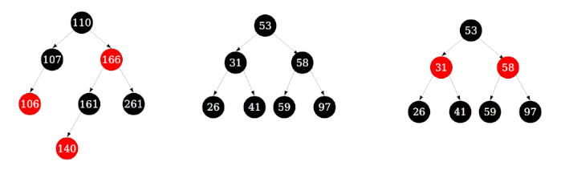

.. include:: <isonum.txt>

Red Black Trees (under develpment)
==================================

**Contents Under Development...**

.. todo:: Read these sources to discover the clearest and look for those that mention how 2-3 and 2-3-4 tree relate to red-balck trees. Perhaps update existing tree related .rst files with something particularly relevant.

A red-black tree is a binary tree representation of a 2-3-4 tree. 

A 2-, 3- and 4-nodes is transformed into its red-black representation as follows:

Visualization link:

* `Red Black Tree Visualization <https://www.cs.usfca.edu/~galles/visualization/RedBlack.html>`_

The Standford CS166 Tree slides below are excellent. They explain:

Binary trees are introduced, then a basic overview of red-black trees, followed by multiway-trees, whose isometry to red-black trees is shown starting around slide #196.

Red-black tree have these properties:

* Every node has a flag indicating whether its either red or black.
* The root is always black
* No red node has a red child.
* Every root-null path in the tree passes through the same number of black nodes.

Below are three examples of valid red-black trees:

Each tree above has a black root as required. The left and right trees are the only trees with red nodes, and in both tree the red nodes have black children. While the left tree is not perfectly balance, it does obey the 4th rule. Take, for example, the path from the root to the right null child
of node 107 passes through two (and only two) black nodes. Every other root-null path also passes through two and only two black nodes. Thus, left tree is a valid red-black tree. Finally, it is clear that in the middle and right trees every root-null path passes through the same number of black node.

Below are some examples of invalid red-black trees:

.. todo:: A comments on why each tree above is invalid and how the tree below are corrected red-black tree representations.

Red-black trees are an isometry of 2-3-4 trees; they represent the structure of 2-3-4 trees in a different way. Many data structures can be designed and analyzed in the same way. 
Huge advantage: Rather than memorizing a complex list of red/black tree rules, just think about what the equivalent operation on the corresponding 2-3-4 tree would be and simulate it with BST operations.

Starting at slide #220, the equivalent 2-3-4 tree insert algorithm is for ashown for an insertion into a red black tree.

`Standford CS166 <https://web.stanford.edu/class/cs166/>`_:

   * `Balanced Trees, Part I <https://web.stanford.edu/class/cs166/lectures/05/Slides05.pdf>`_: **B-Trees** (slides 1-51), **Red Black trees** (slides 52-77), **Multi-way trees** (slides 78-271).
   * `Balanced Trees, Part 2 <https://web.stanford.edu/class/cs166/lectures/06/Slides06.pdf>`_ Red Black tree performance (slides 1-86).

USC `2-3-4 tree and red black tree correspondence <https://ee.usc.edu/~redekopp/cs104/slides/L19b_BalancedBST_BTreeRB.pdf>`_  shows on slides 32-75 relationship of 2-3-4 trees to Red-Black trees.
It contains extensive illustrations how the tree changes, how rotations occur.

The National Chengheng University `Transforming a 2 3 4 tree into a Red Black Tree <http://smile.ee.ncku.edu.tw/old/Links/MTable/Course/DataStructure/2-3,2-3-4&red-blackTree_952.pdf>`_ slides introduce 2 3 trees, 2 3 4 trees, and the show how 2 3 4 trees algorithms are equivalent to red black insert algorithms.

`Open Data structures article <http://opendatastructures.org/ods-java/9_2_RedBlackTree_Simulated_.html>`_ on how 2-3-4 algorithms map to red black trees.

Stackoverflow `Illustration of Relationship of 2 3 4 to Red Black Trees <https://stackoverflow.com/questions/35955246/converting-a-2-3-4-tree-into-a-red-black-tree>`_.

.. todo:: Rank these also most helpful for, say, illustration of xyz, pseudo code, etc.

Digipen.edu's:

* `Overiew of all types of trees <https://azrael.digipen.edu/~mmead/www/Courses/CS280/Trees-2.html>`_ shows BST, 2-3 tree, and red black trees. Concept of rotations.
* `Mapping 2-3-4 Trees into Red-Black Trees <https://azrael.digipen.edu/~mmead/www/Courses/CS280/Trees-Mapping2-3-4IntoRB.html>`_ .

North Illinois University `Insertion relationship between 2-, 3- and 4-trees and Red and Black trees <http://faculty.cs.niu.edu/~freedman/340/340notes/340redblk.htm>`_.

In the CLRS book there is no discussion of the relationship of 2-3-4 trees to red-black trees. After introducing the structure of and rules for red-black trees, a lemma is immediately proved about the maximum possible height
of rb trees. After this, the rotation, insertion and deletion algorthims are discussed in detail. The rb-tree introduced uses a common sentinel node as the left and right child of all leaf nodes.

* `CLRS: Introduction to Algorithms 3rd Edition <http://ressources.unisciel.fr/algoprog/s00aaroot/aa00module1/res/%5BCormen-AL2011%5DIntroduction_To_Algorithms-A3.pdf>`_ **B-Trees** chapter 12, **Red-Black Trees** chapter 13. Instructor's Solution Manual:

   * `CLRS Solution good Illustrations <https://walkccc.github.io/CLRS/>`_.
   * `Instructor's Manual <https://cdn.manesht.ir/19908/Introduction%20to%20Algorithms.pdf>`_
   * `Solutions to "Introduction to Algorithms" by Cormen, Leiserson, Rivest, and Stein CLRS Solutions <https://sites.math.rutgers.edu/~ajl213/CLRS/CLRS.html>`_ 

Red Black Tree Lecture Notes:

* Illustration and synoptic discussion of `red black tree insertion and deletion <https://www.usna.edu/Users/cs/crabbe/SI321/2003-08/red-black/red-black.html>`_ discusses insertion and deletion. 
* Tulane `red black trees <ttp://www.cs.tulane.edu/~carola/teaching/cmps2200/fall17/slides/RB-trees.pdf>`_ contains detailed pseudo code of all **insertion** cases 

Red Black Tree Implementations
~~~~~~~~~~~~~~~~~~~~~~~~~~~~~~

* `Bartosz Milewski’s red-black tree article in C++ using std::shared_ptr <http://bartoszmilewski.com/2013/11/25/functional-data-structures-in-c-trees/>`__
* `Bartosz Milewski’s red-black tree source code <https://github.com/BartoszMilewski/Okasaki/tree/master/RBTree>`_
* `C# Implementation <http://www.jot.fm/issues/issue_2005_03/column6/>`__ from Journal of Object Technology 
* `C++ Implementation <http://samplecodebank.blogspot.com/2011/05/red-black-tree-example-c.html>`__ from a blog on sample source code.
* `Red Black Tree (RB-Tree) Using C++ <http://www.coders-hub.com/2015/07/red-black-tree-rb-tree-using-c.html#.WOEj20cpD0p>`__ from coders-hub.com. 
* `Basic red-black tree in C++ using a fixed key and value type <https://github.com/csilva25/Red_Black_Tree>`__ Cristian Silva, III, repository ongithub.com 
