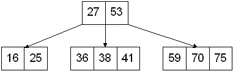
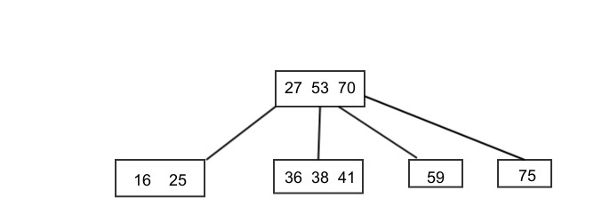
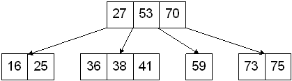
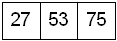
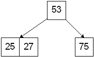
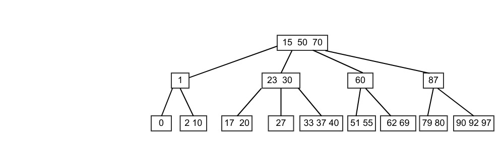
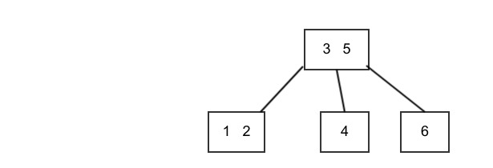
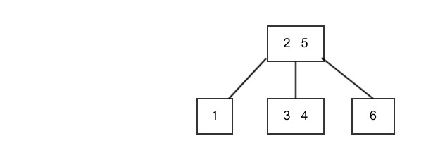
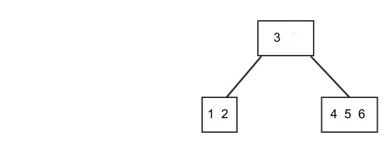

.. include:: <isopub.txt>
.. include:: <isonum.txt>

.. role:: kurt-code

.. _2-3-4-trees:

Implementing a 2 3 4 Tree in C++17
==================================

Implementation links:

1. `2 3 4 Trees a Visual Introduction <https://www.educative.io/page/5689413791121408/80001>`_ is an excellent introduction and explanation of how a 2 3 4 works and how its algorithms work.

2. `B Tress and 2 3 4 Trees <http://www.cs.ubc.ca/~liorma/cpsc320/files/B-trees.pdf>`_

This link has an excellent working example. The explanation is thorough and clear. It gives several example of deleting elements. It uses the in-order predecessor
rather than the successor for the deletion algorithm.

3. `2 3 4 Tree Part1 slides <http://www.unf.edu/~broggio/cop3540/Chapter%2010%20-%202-3-4%20Trees%20-%20Part%201.ppt>`_

This link contains java code for insertion into a 2 3 4 tree.

4. `2 3 Trees and 2 3 4 Trees <http://www.serc.iisc.ernet.in/~viren/Courses/2009/SE286/2-3Trees-Mod.ppt>`_  

This link has a excellent working example and discusses how delete works, using descent restructuring. It uses the swap-with-successor for deletion of internal keys.
It contains a working tree example. It shows that when converting 2-nodes, we first check if we can rotation else we do a merge (since both siblings are 2-nodes).

This link has a more high level pseudo code. 

5. http://www2.thu.edu.tw/~emtools/Adv.%20Data%20Structure/2-3,2-3-4%26red-blackTree_952.pdf 

6. `Tree <https://azrael.digipen.edu/~mmead/www/Courses/CS280/Trees-2.html>`_. This has an overview of BST, 2 3 trees, 2 3 4 trees, and red black trees.

7. `2 3 4 Tree Delete Example <https://azrael.digipen.edu/~mmead/www/Courses/CS280/Trees-2-3-4-delete.html>`_.

tree234's Use of shared_ptr<Node> to Manage Memory
--------------------------------------------------

tree234's root node is of type ``shared<Node>``. tree234's assignament operator and copy constructor are trivial: they simply copy the root node. The underlying root Node therefore is not deleted until its reference count goes to 0. 
Class Node contains the array: type ``std::array<std::shared_ptr<Node>, 4>``.  ``shared_ptr``'s reference counting handles all the memory management for the tree properly.  The children are not deleted until the root is evetually destructed, when
its default constructor invokes the destructor for std::array, which in turn invokes the shared_ptr<Node> destructor. The children qqshared_ptr<Node>qq's reference counts remains one throughout the program's execution become these children
shared_ptr<Node> are never publically exposed and therefore can never copied or assignment outside the scope of class tree234. Thus, only when the root Node is deleted are its left and right children deleted. 

.. note::

   The deletion of the root's left and right children triggers the proper post-order recursive destruction of all the tree's underlying Nodes.

.. todo:: Show print_tree() output of code being copied a few times, then deleted.

How Insertion and Removal Algorithms Maintain a Balanced 2 3 4 Tree
-------------------------------------------------------------------

Insertion
^^^^^^^^^

The insert algorithm always inserts new keys into a leaf node. To ensure that there is always room, 4-nodes are split as they are encountered. This guarantees that we will never have the problem of inserting the middle element of a former
4-node into its parent. When a 4-node is encountered, it is 'split' into two 2-nodes as follows. First, the original 4-node is downsized to a 2-node holding only the smallest key and the two left most children of the original 4-node. Next,
a new 2-node is allocated that holds the 4-node's largest key and whose children become the 4-node's two right most children. Finally, the middle key is inserted into the parent, and the parent adopts the newly allocated 2-node (holding the largest key),
and it shifts its current children as necessary to maintain the tree\ |apos|\ s ordering. The search for the insertion leaf node resumes with the parent. Note: if the parent has now become a 4-node, it is not split (since we know it is not a leaf node, and
we know its relevant children are now 2-nodes).

Here is an example. The key 73 will be inserted into this tree. Therefore the 4-node containing [59, 70, 75] must be split:

   **Figure: 4-node [59, 70, 75] needs to be split**

Following the split, the tree looks like this:

   **Figure: 4-node split into two 2-nodes**

And after the split, the search for the proper leaf node resumes with the parent of the node just split. Note: if the parent node has now also become a 4-node, it is is **not split** (since we know it is not a leaf node). The final tree looks like this:

   **Figure: Tree after 73 inserted into leaf node**

There is a problem, however: if the in-order successor is a 2-node leaf, this leaves an empty leaf node, resulting in an unbalanced tree. 

In summary, we note that after the split a new node has been added to the tree on the same level of the tree as the former 4-node. The parent has a new key added and one additional child, but the tree itself remains balanced. It has only grown "wider" by one 
node on the level of the former 4-node.

The root is a special case. If the root is a 4-node, its parent is nullptr. In this case a new root node is allocated to hold the middle key of the former root. Here is a tree with 4-node root into which 25 will be inserted: 

   **Figure: 4-node root to be split**

After the split of the 4-node root, a new root a level above has been added to the tree, and the new key of 25 has been added the left most child node:

   **Figure: New root added to tree after split**

When the root is split, the tree also remains balanced, but grows upward by one level.

Deletion
^^^^^^^^

To delete a key we "swap" the item to be deleted with its in-order successor. We then delete the key from its new temporary "successor" position. The successor key of any internal node is the first key of the left most leaf node of its first right subtree; for example,
given this tree

   **Figure: Internal Node in-order successor**

the in order successor of 23 is 27, of 50 is 51, of 60 is 62, and so on\ |mdash|\ all successors of these internal nodes are the first key of the left most child leaf node of the right subtree. "Swap" above means we overwrite the item
to be deleted with its in-order successor and then remove the in-order successor from the leaf node. But what if the in order successor is in a 2-node? This would result in an empty node, and an unbalanced tree. To prevent this, as we descend the tree we
turn 2-nodes into 3-nodes. The two techniques for converting 2-nodes into 3-nodes are:  

Case 1: If an adjacent sibling of the 2-node is a 3- or 4-node, we "steal" an item from the sibling by rotating items and moving the subtree. For example, if 4 is to be deleted from this tree

   **Figure: Delete from 4 from 2-node by barrowing**

we barrow the 2 from the left sibling, move it to the parent and bring 3 down from the parent, creating a 3-node. This change that involves the shifting of keys among three nodes reduces the total number of nodes by one, but the tree
remains balanced.

   **Figure: 2-node after barrowing**
 
We then delete 4 from the leaf contain 3 and 4.

Case 2: If each adjacent sibling (there are at most two) has only one item, we know its parent must be a 3- or 4-node (because if it were a 2-node, it will already have been converted to a 3-node). In this case we fuse together the two siblings
and bring a key down from parent, forming a 4-node and shifting all children effected appropriately. For example, say, we wish to delete 6 from our first example:

   **Figure: Delete from 6 from 2-node by fusing siblings**

Since there a no 3- or 4-node siblings, we fuse the 2-node containing 4 into the 2-node containing 6, and we also bring down 5 from the parent, making the leaf node into a 4-node, from which we can delete 6:

   **Figure: 2-node now a 4-node**

The change again only involves three nodes. The total number of nodes is again decreased by one, but the tree remains balanced.

.. note::
   If the key to be deleted is the largest key, there will be no in order successor; however, by applying the 2-node conversion technique above, we ensure that the tree will remain balanced.

.. hint::
    If the key is found in an internal node, the processes of finding its in order successor begins with the subtree rooted at the first child (to the right) that holds larger key(s). If this immediate child is a 2-node, it must be converted
    to a 3-node, but this conversion may also move the original key\ |ndash|\ either as a result of case 1, barrowing, or case 2, fusing sibling. If this happens, we must search again for the new location of the key and then resume the search
    for the in-order successor starting from the new location of the key. In the actual implementation below, **getRemoveSuccessor()** does just that: if the key has moved after **convertTwoNode(pnode)**, it searches again for the key and then
    recurses. See `std::pair<const Node *, int> getRemoveSuccessor(Key key, const Node *&pfound_node, int& key_index) noexcept` below.

Implementation of class tree234
-------------------------------

The template class tree234 implements the 2 3 4 tree. `unique_ptr<Node>` manages the nodes of the tree. The root is also an instance of `unique_ptr<Node>`. Mention copy ctor and move ctor. And how this differs from shared_ptr<Node> implementation.

.. code-block:: cpp

    #ifndef TREE234_H
    #define	TREE234_H
    #include <utility>
    #include <algorithm>
    #include <stdexcept>
    #include <algorithm>
    #include <memory>
    #include <array>
    #include <queue>
    #include <stack>
    #include <sstream>
    #include <exception>
    #include <iosfwd>
    #include <string>
    #include <iostream>
    
    
    template<typename Key, typename Value> class tree234;  // Forward declaration
    
    class DebugPrinter; 
        
    template<typename Key, typename Value> class tree234 {
    
         /*
          * This union eliminates always having to do: const_cast<Key>(p.first) = some_noconst_key;
          * by holding two different types of pairs: _constkey_pair, where member first is 'const Key'; and _pair, where member 
          * first is 'Key'.
          *
          * Note 1: Anonymous unions do not implicitly destruct their members. Therefore we must explicitly call their destructors within 
          *         KeyValue::~KeyValue().
          * Note 2: A user declared destructor by default causes the move constructor and move assignment to be not declared, so
          *         we explictily declare and defined them.
          */
    
       union KeyValue { 
           std::pair<Key, Value>        _pair;  // ...this pair
           std::pair<const Key, Value>  _constkey_pair; 
    
         public:    
           KeyValue() {} 
          ~KeyValue() 
           {
             // Anonymous unions do not implicitly destruct their members. It must be done explicitly.
             _pair.first.~Key();
             _pair.second.~Value();
           } 
          
           KeyValue(Key key, const Value& value) : _pair{key, value} {}
           
           KeyValue(const KeyValue& lhs) : _pair{lhs._pair.first, lhs._pair.second} {}
           
           KeyValue(Key k, Value&& v) : _pair{k, std::move(v)} {} 
       
           KeyValue(KeyValue&& lhs) :  _pair{move(lhs._pair)} {}
       
           KeyValue& operator=(const KeyValue& lhs) noexcept;  
           KeyValue& operator=(KeyValue&& lhs) noexcept; 
    
           constexpr Key&  key()  { return _pair.first; }
           
           constexpr const Key& key() const { return _constkey_pair.first; }
    
           constexpr Value&  value()  { return _pair.second; }
           
           constexpr const Value& value() const { return _constkey_pair.second; }
    
           constexpr const std::pair<Key, Value>& pair() const { return _pair; }
           constexpr std::pair<Key, Value>& pair() { return _pair; }
                   
           constexpr const std::pair<const Key, Value>& constkey_pair() const { return _constkey_pair; }
    
           constexpr std::pair<const Key, Value>& constkey_pair() { return _constkey_pair; }
    
           friend std::ostream& operator<<(std::ostream& ostr, const KeyValue& key_value)
           {
              ostr << "{" << key_value._pair.first << ',' <<  key_value._pair.second <<  "}, ";
              return ostr;
           }
       };
    
       class Node; // Forward feference. 
    
       class Node { // The tree node class. 
         /*
           Note: Since Node depends on both of tree234's template parameters, on both Key and Value, we can 
           make it a nested class. Had it depended on only one template parameter, it could not be a nested class.
          */
         private:  
           friend class tree234<Key, Value>;             
           friend class DebugPrinter;
           static const int MAX_KEYS;   
    
           enum class NodeType : int { two_node=1, three_node=2, four_node=3 };
        
           Node *parent; /* parent is only used for navigation of the tree. It never owns the memory
                            it points to. */
        
           int totalItems; /* If 1, two node; if 2, three node; if 3, four node. */   
        
           std::array<KeyValue, 3> keys_values; 
           
           /*
            * For 2-nodes, children[0] is left pointer, children[1] is right pointer.
            * For 3-nodes, children[0] is left pointer, children[1] the middle pointer, and children[2] the right pointer.
            * And so on for 4-nodes.
            */
        
           std::array<std::shared_ptr<Node>, 4> children;
           
           constexpr Node *getParent() noexcept; 
    
           int getChildIndex() const noexcept;
        
           /* 
            * Returns {true, Node * pnode, int index} if key is found in node and sets pnode and index such that pnode->keys_values[index] == key
            * Returns {false, Node * pnode, int index} if key is if not found, and sets pnode and index such that pnode->keys_values[index] is the
            * next prospective node to be searched one level lower in the tree.
            */
           std::tuple<bool, typename tree234<Key, Value>::Node *, int>  find(Key key) const noexcept;
        
           void insert(KeyValue&& key_value, std::shared_ptr<Node>& newChild) noexcept;
    
           int insert(Key key, const Value& value) noexcept;
           
           // Remove key at index, if found, from node, shifting remaining keys_values to fill the gap.
           KeyValue removeKeyValue(int index) noexcept; 
        
           void connectChild(int childNum, std::shared_ptr<Node>& child) noexcept;
    
           /*
            * Removes child node (implictly using move ctor) and shifts its children to fill the gap. Returns child pointer.
            */  
           std::shared_ptr<Node> disconnectChild(int child_index) noexcept; 
        
           void insertChild(int childNum, std::shared_ptr<Node> &pChild) noexcept;
        
           /* 
            * Called during remove(Key keym, Node *).
            * Merges the 2-node children of a parent 2-node into the parent, making the parent a 4-node. The parent, then, adopts the "grand children", and the children
            * after having been adopted by the parent are deallocated. 
            */
           Node *fuseWithChildren() noexcept; 
           
          public:
                 
               Node() noexcept;
               
              ~Node() // For debug purposes only
               { 
                  // std::cout << "~Node(): " << *this << std::endl; 
               }
    
               explicit Node(Key small, const Value& value, Node *parent=nullptr) noexcept;
    
               explicit Node(const Node& node, Node *lhs_parent=nullptr) noexcept : keys_values{node.keys_values}, totalItems{node.totalItems}, parent{lhs_parent}
               {
               } 
    
               explicit Node(KeyValue&& key_value) noexcept; 
               
               constexpr const Node *getParent() const noexcept;
        
               constexpr int getTotalItems() const noexcept;
               constexpr int getChildCount() const noexcept;
    
               constexpr const Node *getRightMostChild() const noexcept { return children[getTotalItems()].get(); }
    
               // method to help in debugging
               void printKeys(std::ostream&);
    
               constexpr Key& key(int i ) { return keys_values[i].key(); } 
    
               constexpr const Key& key(int i ) const { return keys_values[i].key(); } 
    
               constexpr Value& value(int i ) { return keys_values[i].value(); } 
    
               constexpr const Value& value(int i ) const { return keys_values[i].value(); } 
                   
               constexpr const std::pair<const Key, Value>& constkey_pair(int i) const { return keys_values[i].constkey_pair(); }
        
               constexpr std::pair<const Key, Value>& constkey_pair(int i) { return keys_values[i]._constkey_pair(); }
    
               int getIndexInParent() const;
    
               constexpr bool isLeaf() const noexcept; 
               constexpr bool isTwoNode() const noexcept;
               constexpr bool isThreeNode() const noexcept;
               constexpr bool isFourNode() const noexcept;
               constexpr bool isEmpty() const noexcept; 
    
               constexpr const std::pair<Key, Value>& pair(int index) const noexcept 
               {
                 return keys_values[index].pair(); 
               }
    
               constexpr std::pair<Key, Value>& pair(int index ) noexcept 
               { 
                 return keys_values[index].pair(); 
               }
    
               std::ostream& print(std::ostream& ostr) const noexcept;
       
               friend std::ostream& operator<<(std::ostream& ostr, const Node& node234)
               { 
                 return node234.print(ostr);
               }
    
      }; // end class Tree<Key, Value>::Node  
      
      class NodeLevelOrderPrinter {
    
          std::ostream& ostr;
          int current_level;
          int height;
    
          void display_level(std::ostream& ostr, int level) const noexcept
          {
            ostr << "\n\n" << "current_level = " <<  current_level << ' '; 
               
            // Provide some basic spacing to tree appearance.
            std::size_t num = height - current_level + 1;
            
            std::string str( num, ' ');
            
            ostr << str; 
          }
    
          std::ostream& (Node::*pmf)(std::ostream&) const noexcept;
    
         public: 
            
         NodeLevelOrderPrinter (int hght,  std::ostream& (Node::*pmf_)(std::ostream&) const noexcept, std::ostream& ostr_in): height{hght}, ostr{ostr_in}, current_level{0}, pmf{pmf_} {}
    
         NodeLevelOrderPrinter (const NodeLevelOrderPrinter& lhs): height{lhs.height}, ostr{lhs.ostr}, current_level{lhs.current_level}, pmf{lhs.pmf} {}
    
         void operator ()(const Node *pnode, int level)
         { 
             // Did current_level change?
             if (current_level != level) { 
            
                 current_level = level;
            
                 display_level(ostr, level);       
             }
    
             (pnode->*pmf)(std::cout);
    
             std::cout << ' ' << std::flush;
         }
      };
    
     private:
    
       friend class DebugPrinter;
    
        std::shared_ptr<Node>  root; 
    
        int  tree_size; // adjusted by insert(), remove(), operator=(const tree234...), move ctor
    
        // Implementations of the public depth-frist traversal methods    
        template<typename Functor> void DoInOrderTraverse(Functor f, const Node *proot) const noexcept;
    
        template<typename Functor> void DoPostOrderTraverse(Functor f,  const Node *proot) const noexcept;
    
        template<typename Functor> void DoPreOrderTraverse(Functor f, const Node *proot) const noexcept;
    
        void split(Node *node) noexcept;  // called during insert(Key key) to split 4-nodes when encountered.
    
        // Called during remove(Key key)
        bool remove(Node *location, Key key); 
        
        // Called during remove(Key key, Node *) to convert two-node to three- or four-node during descent of tree.
        Node *convertTwoNode(Node *node) noexcept;
    
        // These methods are called by convertTwoNode()
        Node *fuseSiblings(Node *parent, int node2_id, int sibling_id) noexcept;
    
        Node *leftRotation(Node *p2node, Node *psibling, Node *parent, int parent_key_index) noexcept;
    
        Node *rightRotation(Node *p2node, Node *psibling, Node *parent, int parent_key_index) noexcept;
    
        // Non recursive in-order traversal of tree methods
        std::pair<const Node *, int> getSuccessor(const Node *current, int key_index) const noexcept;
        std::pair<const Node *, int> getPredecessor(const Node *current, int key_index) const noexcept;
    
        // Subroutines of the two methods above.
        std::pair<const Node *, int> getInternalNodeSuccessor(const Node *pnode,  int index_of_key) const noexcept;
        std::pair<const Node *, int> getInternalNodePredecessor(const Node *pnode,  int index_of_key) const noexcept;
    
        std::pair<const Node *, int> getLeafNodeSuccessor(const Node *pnode, int key_index) const;
        std::pair<const Node *, int> getLeafNodePredecessor(const Node *pnode, int key_index) const;
       
        // Returns node with smallest value of tree whose root is 'root'
        const Node *min(const Node* root) const noexcept; 
        const Node *max(const Node* root) const noexcept; 
        
        int  height(const Node *pnode) const noexcept;
        
        int  depth(const Node *pnode) const noexcept;
        bool isBalanced(const Node *pnode) const noexcept;
    
        bool find_(const Node *current, Key key) const noexcept; // called by 'bool find(Key keu) const'
    
        std::pair<bool, Node *> split_find(Node *pnode, Key key) noexcept;  // Called during insert
    
        Node *convert_findmin(Node *pnode) noexcept; // Called during remove()
    
      public:
        // Basic STL-required types:
    
        using value_type      = std::pair<const Key, Value>; 
        using difference_type = long int;
        using pointer         = value_type*; 
        using reference       = value_type&; 
        using node_type       = Node; 
    
         explicit tree234() noexcept : root{}, tree_size{0} { } 
    
         tree234(const tree234& lhs) noexcept; 
         tree234(tree234&& lhs) noexcept;     // move constructor
    
         tree234& operator=(const tree234& lhs) noexcept; 
         tree234& operator=(tree234&& lhs) noexcept;    // move assignment
    
         tree234(std::initializer_list<std::pair<Key, Value>> list) noexcept; 
         
         constexpr int size() const;
    
        ~tree234(); 
    
        // Breadth-first traversal
        template<typename Functor> void levelOrderTraverse(Functor f) const noexcept;
    
        // Depth-first traversals
        template<typename Functor> void inOrderTraverse(Functor f) const noexcept;
    
        template<typename Functor> void iterativeInOrderTraverse(Functor f) const noexcept;
    
        template<typename Functor> void postOrderTraverse(Functor f) const noexcept;
        template<typename Functor> void preOrderTraverse(Functor f) const noexcept;
       
        // Used during development and testing 
        template<typename Functor> void debug_dump(Functor f) noexcept;
    
        bool find(Key key) const noexcept;
    
        void insert(Key key, const Value &) noexcept; 
        
        void insert(const value_type& pair) noexcept { insert(pair.first, pair.second); } 
    
        bool remove(Key key);
    
        void printlevelOrder(std::ostream&) const noexcept;
        
        void printInOrder(std::ostream&) const noexcept;
        
        void printPreOrder(std::ostream&) const noexcept;
        
        void printPostOrder(std::ostream&) const noexcept;
    
        bool isEmpty() const noexcept;
    
        int  height() const noexcept;
    
        bool isBalanced() const noexcept;
    
        friend std::ostream& operator<<(std::ostream& ostr, const tree234<Key, Value>& tree)
        {
           tree.printlevelOrder(ostr);
           return ostr;
        }
    
        // Bidirectional stl-compatible constant iterator
        class iterator { 
                                                     
          public:
            using difference_type   = std::ptrdiff_t; 
            using value_type        = tree234<Key, Value>::value_type; 
            using reference	        = value_type&; 
            using pointer           = value_type*;
            
            using iterator_category = std::bidirectional_iterator_tag; 
                                                
            friend class tree234<Key, Value>; 
    
          private:
             tree234<Key, Value>& tree; 
    
             const Node *current;
             const Node *cursor;
	     int key_index;
             
             int getChildIndex(const typename tree234<Key, Value>::Node *p) const noexcept;
    
             std::pair<const typename tree234<Key, Value>::Node *, int> findLeftChildAncestor() noexcept;
    
             iterator& increment() noexcept; 
    
             iterator& decrement() noexcept;
    
             iterator(tree234<Key, Value>& lhs, int i);  // called by end()   
    
             constexpr reference dereference() noexcept 
             { 
                 return cursor->constkey_pair(key_index); 
             } 
    
          public:
    
             explicit iterator(tree234<Key, Value>&); 
    
             iterator(const iterator& lhs); 
    
             iterator(iterator&& lhs); 
     
             bool operator==(const iterator& lhs) const;
             
             constexpr bool operator!=(const iterator& lhs) const { return !operator==(lhs); }
    
             constexpr const std::pair<const Key, Value>& dereference() const noexcept 
             { 
                 return cursor->constkey_pair(key_index); 
             }
             
             iterator& operator++() noexcept; 
             iterator operator++(int) noexcept;
    
             iterator& operator--() noexcept;
             iterator operator--(int) noexcept;
             
             std::pair<const Key, Value>& operator*() noexcept { return dereference(); } 
    
             const std::pair<const Key, Value>& operator*() const noexcept { return dereference(); }
             
             typename tree234<Key, Value>::KeyValue *operator->() noexcept;
        };
    
        class const_iterator : public std::iterator<std::bidirectional_iterator_tag, const value_type> {
                                                     
          public:
            using difference_type   = std::ptrdiff_t; 
            using value_type        = tree234<Key, Value>::value_type; 
            using reference	        = const value_type&; 
            using pointer           = const value_type*;
            
            using iterator_category = std::bidirectional_iterator_tag; 
                                                
            friend class tree234<Key, Value>;   
    
          private:
             iterator iter; 
     
             explicit const_iterator(const tree234<Key, Value>& lhs, int i);
          public:
             
             explicit const_iterator(const tree234<Key, Value>& lhs);
    
             const_iterator(const const_iterator& lhs);
             const_iterator(const_iterator&& lhs); 
    
             // This ctor provide implicit conversion from iterator to const_iterator     
             const_iterator(const typename tree234<Key, Value>::iterator& lhs); 
    
             bool operator==(const const_iterator& lhs) const;
             bool operator!=(const const_iterator& lhs) const;
             
             const_iterator& operator++() noexcept;
             const_iterator operator++(int) noexcept;
             const_iterator& operator--() noexcept;
             const_iterator operator--(int) noexcept;
    
             const std::pair<const Key,Value>&  operator*() const noexcept 
             {
               return iter.dereference(); 
             } 
    
             const std::pair<const Key, Value> *operator->() const noexcept { return &this->operator*(); } 
        };
    
        iterator begin() noexcept;  
        iterator end() noexcept;  
      
        const_iterator begin() const noexcept;  
        const_iterator end() const noexcept;  
        
        using reverse_iterator = std::reverse_iterator<iterator>;
        using const_reverse_iterator = std::reverse_iterator<const_iterator>;
        
        reverse_iterator rbegin() noexcept;  
        reverse_iterator rend() noexcept;  
     
        const_reverse_iterator rbegin() const noexcept;  
        const_reverse_iterator rend() const noexcept;    
    };
    
    template<class Key, class Value> inline bool tree234<Key, Value>::isEmpty() const noexcept
    {
      return root == nullptr ? true : false;
    }
    
    template<typename Key, typename Value> inline typename tree234<Key, Value>::KeyValue& tree234<Key, Value>::KeyValue::operator=(const KeyValue& lhs) noexcept
    {
      if (this != &lhs) { 
    
        pair() = lhs.pair();
    
      }
      return *this;
    }
    
    template<typename Key, typename Value> inline typename tree234<Key, Value>::KeyValue& tree234<Key, Value>::KeyValue::operator=(KeyValue&& lhs) noexcept
    {
      if (this != &lhs) { 
    
        pair() = std::move(lhs.pair());
    
      }
      return *this;
    }
    
    template<typename Key, typename Value> const int  tree234<Key, Value>::Node::MAX_KEYS = 3; 
    
    /*
     * Node constructors. Note: While all children are initialized to nullptr, this is not really necessary. 
     * Instead your can simply set children[0] = nullptr, since a Node is a leaf if and only if children[0] == 0'
     */
    template<typename Key, typename Value> inline  tree234<Key, Value>::Node::Node()  noexcept : totalItems{0}, parent{nullptr}, children()
    { 
    }
    
    template<typename Key, typename Value> inline  tree234<Key, Value>::Node::Node(Key small, const Value& value_in, Node *parent_in)  noexcept : totalItems{1}, parent{parent_in}, children()
    { 
       key(0) = small; 
       value(0) = value_in;
    }
    
    template<class Key, class Value> std::ostream& tree234<Key, Value>::Node::print(std::ostream& ostr) const noexcept
    {
       ostr << "[";
    
       if (getTotalItems() == 0) { // remove() situation when merge2Nodes() is called
    
           ostr << "empty"; 
    
       } else {
    
            for (auto i = 0; i < getTotalItems(); ++i) {
    
                ostr << key(i); // or to print both keys and values do: ostr << keys_values[i];
    
                if (i + 1 == getTotalItems())  {
                    continue;
    
                } else { 
                    ostr << ", ";
                }
            }
       }
    
       ostr << "]";
       return ostr;
    }
    
    template<typename Key, typename Value> inline  tree234<Key, Value>::Node::Node(KeyValue&& key_value) noexcept : parent{nullptr}, totalItems{1}
    {
       keys_values[0] = std::move(key_value); 
    }
    
    template<class Key, class Value> int tree234<Key, Value>::Node::getIndexInParent() const 
    {
      for (int child_index = 0; child_index <= parent->getTotalItems(); ++child_index) { // Check the address of each of the children of the parent with the address of "this".
    
           if (this == parent->children[child_index].get()) {
               return  child_index;
           }
      }
    
      throw std::logic_error("Cannot find the parent child index of the node. The node may be the tree's root or the invariant may have been violated.");
    }
    
    
    template<typename Key, typename Value> inline tree234<Key, Value>::tree234(const tree234<Key, Value>& lhs) noexcept 
    {
     if (root == lhs.root) { // are they the same?
    
          return;
      }
    
      root = lhs.root;
    }
     
    // move constructor
    template<typename Key, typename Value> inline tree234<Key, Value>::tree234(tree234&& lhs) noexcept : root{std::move(lhs.root)}, tree_size{lhs.tree_size}  
    {
        root->parent = nullptr;
        lhs.tree_size = 0;
    }
    
    template<typename Key, typename Value> inline tree234<Key, Value>::tree234(std::initializer_list<std::pair<Key, Value>> il) noexcept : root(nullptr), tree_size{0} 
    {
       for (auto& x: il) { // simply call tree234<Key, Value>::insert(x)
             
           insert(x.first, x.second);
       }
    }
    
    /*
    Finding the successor of a given node 
    -------------------------------------
    Requires:
        1. If position is beg, Node *current and key_index MUST point to first key in tree. 
        2. If position is end, Node *current and key_index MUST point to last key in tree.
          
        3. If position is in_between, current and key_index do not point to either the first key in the tree or last key. If the tree has only one node,
           the state can only be in_between if the first node is a 3-node.
    
        Returns:
        pair<const Node *, int>, where pnode->key(key_index) is next in-order key. Note, if the last key has already been visited, the pointer returned will be nullptr.
        The pseudo code for getting the successor is from: http://ee.usc.edu/~redekopp/cs104/slides/L19_BalancedBST_23.pdf:
    */
    template<class Key, class Value> std::pair<const typename tree234<Key, Value>::Node *, int> tree234<Key, Value>::getSuccessor(const Node *current, int key_index) const noexcept
    {
      if (current->isLeaf()) { // If leaf node
         
         if (current == root.get()) { // special case: root is leaf      
     
             if (!root->isTwoNode() && key_index != (root->getTotalItems() - 1)) { 
    
                 return {current, key_index + 1};
             } 
                      
             return {nullptr, 0}; // There is no successor
     
         } else {
    
            return getLeafNodeSuccessor(current, key_index);
         }
    
      } else { // else internal node
    
          return getInternalNodeSuccessor(current, key_index);
      }
    }
    
    /* 
       Requires:
       1. pnode is an internal node not a leaf node.
       2. If pnode is a 3-node, then key_index is 1 not 0.
       Returns:
       pointer to successor of internal node.
       Note: When a 2 3 tree node is a 3-node, it has two "right" chidren from the point of view of its first key and two "left" children from the point of view of its
       second key.
     */
    template<class Key, class Value> std::pair<const typename tree234<Key, Value>::Node *, int> tree234<Key, Value>::getInternalNodeSuccessor(const typename tree234<Key, Value>::Node *pnode, int key_index) const noexcept	    
    {
     // Get first right subtree of pnode, and descend to its left most left node.
     for (const Node *cursor =  pnode->children[key_index + 1].get(); cursor != nullptr; cursor = cursor->children[0].get()) {  
    
        pnode = cursor;
     }
    
     return {const_cast<Node *>(pnode), 0};
    }
    
    /*
     Requires:
     1. pnode is a leaf node, either a 2 or 3-node
     2. If pnode is 3-node, then key_index, the index into pnode->keys_values[].key(), must be 1, the second key. It can never be 0, the first key.
     */
    template<class Key, class Value> std::pair<const typename tree234<Key, Value>::Node *, int> tree234<Key, Value>::getLeafNodeSuccessor(const Node *pnode, int key_index) const 
    {
      // Handle the easy case: a 3- or 4-node in which key_index is not the right most value in the node.
      if (!pnode->isTwoNode() && (pnode->getTotalItems() - 1) != key_index) { 
    
          return {pnode, key_index + 1}; 
      }
      // Key is the right most key in a leaf node
      Node *successor = nullptr;
    
      auto child_index = pnode->getChildIndex(); 
      
      auto current_key = pnode->key(key_index);
    
      if (pnode->parent->children[child_index].get() == pnode->parent->getRightMostChild()) { // If pnode is the right-most child of its parent... 
    
      /*
       pnode is the right-most child of its parent, so we must find the first ancestor--parent, grandparent, great grandparent, etc--that is in a "greater than" node.key(i), i.e., an ancestor->key(j) that is to the right of node.key(i). 
       Note: We know that if it is a 3- or 4-node, then key_index is the right most value in the node. Since a 2-node only has one value, it is by default the "right most".
       To find this ancester, we ascend the tree until we encounter the first ancestor that is not a right-most child.  We select its left-most value since it is the smallest value that is larger than pnode->key(key_index).
       */
           const Node *parent = pnode->parent;
           
           // Ascend the parent pointer as long as the node continues to be the right most child (of its parent). 
           for(;pnode == parent->getRightMostChild(); parent = parent->parent)  { 
           
               // pnode is still the right most child, but if it is also the root, then, there is no successor (because pnode was the largest node in the tree). 
               if (parent == root.get()) {
                  
                   return {nullptr, 0};  // To indicate "no-successor" we return the pair: {nullptr, 0} TODO: I could return a tuple<bool, const Node *, int>
               }
           
               pnode = parent;
           }
           // We select its left-most value since it is the smallest value that is larger than pnode->key(key_index).
           auto successor = 0;
    
           for (; successor < parent->getTotalItems() && current_key > parent->key(successor); ++successor);
             
           return {parent, successor};
           
    
      } else { 
          /* 
            ...otherwise, we know that pnode that for 2, 3 and 4-nodes pnode is NOT the right most child of its parent (and it is a leaf). We know that if it is a 2, 3, or 4-node, it is not the right most. 
            We also know that key_index is the right most value of pnode--right? So need to ascertain the index next_index such that pnode->parent->key(next_index) > pnode->key(key_index). How can next_index be calculated
            from the input parameters and this use-case?
            Comment: We can view a 3-node as two catenated 2-nodes in which the the middle child is shared between these two "2-nodes", like this
          
               [3,       5]  
               /  \     / \
              /    \   /   \
            [1, 2]  [3, 4]  [6]
            While a 4-node can be viewed as three catenated 2-nodes in which the two middle child are shared
              
               [2,   4,   6]  
              /  \  / \  / \
            [1]  [3]   [5]  [7] 
            If the leaft node is a 3- or 4-node, we already know (from the first if-test) that the current key is the last, ie, pnode->getTotalItems() - 1. So the we simply go up on level to find the in order successor.    
            We simply need to determine the index in the parent to choose.
          */
    
         if (child_index > static_cast<int>(Node::NodeType::four_node)) {
    
             throw std::logic_error("child_index was not between 0 and 3 in getLeafNodeSuccessor()");
         }
    
         return {pnode->parent, child_index};
      }  
    }
    
    // copy assignment
    template<typename Key, typename Value> inline tree234<Key, Value>& tree234<Key, Value>::operator=(const tree234& lhs) noexcept 
    {
      if (root == lhs.root) { // are they the same?
    
           return *this;
      }
    
      tree_size = lhs.tree_size;         
      root = lhs.root;  
    
      return *this;
    }
    
    
    template<typename Key, typename Value> inline void tree234<Key, Value>::Node::printKeys(std::ostream& ostr)
    {
      ostr << "["; 
    
      for(auto i = 0; i < getTotalItems(); ++i) {
    
          ostr << key(i);
    
          if (i < getTotalItems() - 1)       {
    
             ostr << ", ";
          } 
      }
    
      ostr << "]";
    }
    
    template<typename Key, typename Value> inline constexpr int tree234<Key, Value>::Node::getTotalItems() const noexcept
    {
       return totalItems; 
    }
    
    template<typename Key, typename Value> inline constexpr int tree234<Key, Value>::Node::getChildCount() const noexcept
    {
       return totalItems + 1; 
    }
    
    template<typename Key, typename Value> inline constexpr bool tree234<Key, Value>::Node::isTwoNode() const noexcept
    {
       return (totalItems == static_cast<int>(NodeType::two_node)) ? true : false;
    }
    
    template<typename Key, typename Value> inline constexpr bool tree234<Key, Value>::Node::isThreeNode() const noexcept
    {
       return (totalItems == static_cast<int>(NodeType::three_node)) ? true : false;
    }
    
    template<typename Key, typename Value> inline constexpr bool tree234<Key, Value>::Node::isFourNode() const noexcept
    {
       return (totalItems == static_cast<int>(NodeType::four_node)) ? true : false;
    }
    
    template<typename Key, typename Value> inline constexpr bool tree234<Key, Value>::Node::isEmpty() const noexcept
    {
       return (totalItems == 0) ? true : false;
    }
    
    template<typename Key, typename Value> inline constexpr int tree234<Key, Value>::size() const
    {
      return tree_size;
    }
                 
    template<typename Key, typename Value> inline int tree234<Key, Value>::height() const noexcept
    {
      int depth = 0;
    
      for (auto current = root.get(); current != nullptr; current = current->children[0].get()) {
    
           ++depth;
      }
    
      return depth;
    }
    // move assignment
    template<typename Key, typename Value> inline tree234<Key, Value>& tree234<Key, Value>::operator=(tree234&& lhs) noexcept 
    {
        tree_size = lhs.tree_size;
    
        lhs.tree_size = 0;
    
        root = std::move(lhs.root);
    
        root->parent = nullptr;
    }
    /*
     * F is a functor whose function call operator takes two parameters: a Node * and an int indicating the depth of the node from the root, which has depth 1.
     */
    template<typename Key, typename Value> template<typename Functor> void tree234<Key, Value>::levelOrderTraverse(Functor f) const noexcept
    {
       if (root.get() == nullptr) return;
       
       // pair of: 1. Node pointer and 2. level of tree.
       std::queue<std::pair<const Node*, int>> q; 
    
       auto level = 1;
    
       q.push({root.get(), level});
    
       while (!q.empty()) {
    
            auto [pnode, tree_level] = q.front(); // uses C++17 unpacking
    
            f(pnode, tree_level); // For example: print out all the keys_values in pnode.
             
            if (!pnode->isLeaf()) {
                
                for(auto i = 0; i < pnode->getChildCount(); ++i) {
    
                   q.push({pnode->children[i].get(), tree_level + 1});  
                }
            }
            q.pop(); 
       }
    }
    
    template<typename Key, typename Value> template<typename Functor> inline void tree234<Key, Value>::iterativeInOrderTraverse(Functor f) const noexcept
    {
       const Node *current = min(root.get());
       int key_index = 0;
    
       while (current != nullptr)  {
     
          f(current->pair(key_index)); 
    
          std::pair<const Node *, int> pair = getSuccessor(current, key_index);  
      
          current = pair.first;
          key_index = pair.second;
      }
    }
    
    template<typename Key, typename Value> inline const typename tree234<Key, Value>::Node *tree234<Key, Value>::min(const Node *current) const noexcept
    {
       while (current->children[0].get() != nullptr) {
    
            current = current->children[0].get();
       }
       return current;
    }
    
    template<typename Key, typename Value> inline const typename tree234<Key, Value>::Node *tree234<Key, Value>::max(const Node *current) const noexcept
    {
       while (current->getRightMostChild() != nullptr) {
    
            current = current->getRightMostChild();
       }
       return current;
    }
    template<typename Key, typename Value> template<typename Functor> inline void tree234<Key, Value>::inOrderTraverse(Functor f) const noexcept
    {
       DoInOrderTraverse(f, root.get());
    }
    
    template<typename Key, typename Value> template<typename Functor> inline void tree234<Key, Value>::postOrderTraverse(Functor f) const noexcept
    {
       DoPostOrderTraverse(f, root.get());
    }
    
    template<typename Key, typename Value> template<typename Functor> inline void tree234<Key, Value>::preOrderTraverse(Functor f) const noexcept
    {
       DoPreOrderTraverse(f, root.get());
    }
    
    template<typename Key, typename Value> template<typename Functor> inline void tree234<Key, Value>::debug_dump(Functor f) noexcept
    {
       DoPostOrder4Debug(f, root.get());
    }
    /*
     * post order traversal 
     */
    template<typename Key, typename Value> template<typename Functor> void tree234<Key, Value>::DoPostOrderTraverse(Functor f, const Node *current) const noexcept
    {  
       if (current == nullptr) {
    
            return;
       }
    
       switch (current->getTotalItems()) {
    
          case 1: // two node
                DoPostOrderTraverse(f, current->children[0].get());
    
                DoPostOrderTraverse(f, current->children[1].get());
    
                f(current->constkey_pair(0));
                break;
    
          case 2: // three node
                DoPostOrderTraverse(f, current->children[0].get());
    
                DoPostOrderTraverse(f, current->children[1].get());
    
                f(current->constkey_pair(0));
    
                DoPostOrderTraverse(f, current->children[2].get());
    
                f(current->constkey_pair(1));
                break;
    
          case 3: // four node
                DoPostOrderTraverse(f, current->children[0].get());
    
                DoPostOrderTraverse(f, current->children[1].get());
    
                f(current->constkey_pair(0));
    
                DoPostOrderTraverse(f, current->children[2].get());
    
                f(current->constkey_pair(1));
    
                DoPostOrderTraverse(f, current->children[3].get());
    
                f(current->constkey_pair(1));
     
                break;
       }
    }
    /*
     * pre order traversal 
     */
    template<typename Key, typename Value> template<typename Functor> void tree234<Key, Value>::DoPreOrderTraverse(Functor f, const Node *current) const noexcept
    {  
    
      if (current == nullptr) {
    
            return;
       }
    
       switch (current->getTotalItems()) {
    
          case 1: // two node
            f(current->constkey_pair(0));
    
            DoPreOrderTraverse(f, current->children[0].get());
    
            DoPreOrderTraverse(f, current->children[1].get());
    
            break;
    
          case 2: // three node
            f(current->constkey_pair(0));
    
            DoPreOrderTraverse(f, current->children[0].get());
    
            DoPreOrderTraverse(f, current->children[1].get());
    
            f(current->constkey_pair(1));
    
            DoPreOrderTraverse(f, current->children[2].get());
    
            break;
    
          case 3: // four node
            f(current->constkey_pair(0));
    
            DoPreOrderTraverse(f, current->children[0].get());
    
            DoPreOrderTraverse(f, current->children[1].get());
    
            f(current->constkey_pair(1));
    
            DoPreOrderTraverse(f, current->children[2].get());
    
            f(current->constkey_pair(2));
    
            DoPreOrderTraverse(f, current->children[3].get());
    
            break;
       }
    }
    
    /*
     * In order traversal
     */
    template<typename Key, typename Value> template<typename Functor> void tree234<Key, Value>::DoInOrderTraverse(Functor f, const Node *current) const noexcept
    {     
       if (current == nullptr) return;
    
       switch (current->getTotalItems()) {
    
          case 1: // two node
            DoInOrderTraverse(f, current->children[0].get());
    
            f(current->constkey_pair(0));
    
            DoInOrderTraverse(f, current->children[1].get());
            break;
    
          case 2: // three node
            DoInOrderTraverse(f, current->children[0].get());
    
            f(current->constkey_pair(0));
    
            DoInOrderTraverse(f, current->children[1].get());
     
            f(current->constkey_pair(1));
    
            DoInOrderTraverse(f, current->children[2].get());
            break;
    
          case 3: // four node
            DoInOrderTraverse(f, current->children[0].get());
    
            f(current->constkey_pair(0));
    
            DoInOrderTraverse(f, current->children[1].get());
     
            f(current->constkey_pair(1));
    
            DoInOrderTraverse(f, current->children[2].get());
    
            f(current->constkey_pair(2));
    
            DoInOrderTraverse(f, current->children[3].get());
     
            break;
       }
    }
    
    /*
     * Requires: childIndex is within the range for the type of node.
     * child is not nullptr.
     * connectChild() is equivalent to doing:
     *
     * newRight->children[0] = std::move(node->children[2]);
     * newRight->children[0]->parent = newRight; 
     * newRight->children[1] = std::move(node->children[3]);
     * newRight->children[1]->parent = newRight; 
     *
     */
    template<typename Key, typename Value> inline void  tree234<Key, Value>::Node::connectChild(int childIndex, std::shared_ptr<Node>& child)  noexcept
    {
      children[childIndex] = std::move( child ); 
      
      if (children[childIndex] != nullptr) { 
    
           children[childIndex]->parent = this; 
      }
    }
    /*
     * Returns {true, *this, key's index} if key is found in node.
     * Returns {false, point to next child with which to continue the descent search downward (toward a leaf node), 0} if key not found. 
     */
    template<class Key, class Value> inline std::tuple<bool, typename tree234<Key, Value>::Node *, int> tree234<Key, Value>::Node::find(Key lhs_key) const noexcept 
    {
      for(auto i = 0; i < getTotalItems(); ++i) {
    
         if (lhs_key < key(i)) {
                
             return {false, children[i].get(), 0};
    
         } else if (key(i) == lhs_key) {
    
             return {true, const_cast<Node *>(this), i};
         }
      }
    
      // It must be greater than the last key (because it is not less than or equal to it).
      //next = children[totalItems].get(); 
      return {false, children[getTotalItems()].get(), 0};
    }
    
    /*
     * Require: childIndex is within the range for the type of node.
     * Returns: child pointer.
     * Note: Always call disconnectChild() before removeItem(), or it will not work correctly because totalItems
     * will have been altered.
     */
    
    template<typename Key, typename Value> inline std::shared_ptr<typename tree234<Key, Value>::Node> tree234<Key, Value>::Node::disconnectChild(int childIndex) noexcept // ok
    {
      std::shared_ptr<Node> node{ std::move(children[childIndex] ) }; // invokes shared_ptr<Node> move ctor.
    
      // shift children (whose last 0-based index is totalItems) left to overwrite removed child i.
      for(auto i = childIndex; i < getTotalItems(); ++i) {
    
           children[i] = std::move(children[i + 1]); // shift remaining children to the left. Calls shared_ptr<Node>::operator=(shared_ptr<Node>&&)
      } 
    
      return node; // invokes shared_ptr<Node> move constructor since node is an rvalue.
    }
    /*
     * Preconditions: node is not full, not a four node, and key is not present in node, which may or may not
     * be a leaf node.  Shifts keys_values in node as needed so that key will be inserted in sorted position. Returns index
     * of inserted key.
     */
    
    template<typename Key, typename Value> int  tree234<Key, Value>::Node::insert(Key lhs_key, const Value& lhs_value)  noexcept // ok. Maybe add a move version, too: insertKey(Key, Value&&)
    { 
      // start on right, examine items
      for(auto i = getTotalItems() - 1; i >= 0 ; --i) {
    
          if (lhs_key < key(i)) { // if key[i] is bigger
    
              keys_values[i + 1] = std::move(keys_values[i]); // shift it right
    
          } else {
    
              key(i + 1) = lhs_key; // insert new item
              value(i + 1) = lhs_value;  
            ++totalItems;        // increase the total item count
              return i + 1;      // return index of inserted key.
          } 
        } 
    
        // key is smaller than all keys_values, so insert it at position 0
        key(0) = lhs_key;  
        value(0) = lhs_value; 
      ++totalItems; // increase the total item count
        return 0;
    }
    
    template<typename Key, typename Value> void tree234<Key, Value>::Node::insert(KeyValue&& key_value, std::shared_ptr<Node>& largerNode) noexcept 
    { 
      // start on right, examine items
      for(auto i = getTotalItems() - 1; i >= 0 ; --i) {
    
          if (key_value.key() < key(i)) { // if key[i] is bigger
    
              keys_values[i + 1] = std::move(keys_values[i]); // shift it right...
    
          } else {
    
              keys_values[i + 1] = std::move(key_value);
    
            ++totalItems;        // increase the total item count
    
              insertChild(i + 2, largerNode); 
              return;      // return index of inserted key.
          } 
        } 
    
        // key is smaller than all keys_values, so insert it at position 0
        keys_values[0] = std::move(key_value); 
    
      ++totalItems; // increase the total item count
    
        insertChild(1, largerNode); 
        return;
    }
    /*
     Input: A new child to insert at child index position insert_index. The current number of children currently is given by children_num.
     */
    template<typename Key, typename Value> void tree234<Key, Value>::Node::insertChild(int insert_index, std::shared_ptr<Node>& newChild) noexcept
    {
       int last_index = getTotalItems() - 1;  // While totalItems reflects the correct number of keys, the number of children currently is also equal to the number of keys.
    
       // ...move its children right, starting from its last child index and stopping just before insert_index.
       for(auto i = last_index; i >= insert_index; i--)  {
    
           connectChild(i + 1, children[i]);       
       }
    
       // Then insert the new child whose key is larger than key_value.key().
       connectChild(insert_index,  newChild);
    }
    
    template<typename Key, typename Value> inline typename tree234<Key, Value>::KeyValue tree234<Key, Value>::Node::removeKeyValue(int index) noexcept 
    {
      KeyValue key_value = std::move(keys_values[index]); 
    
      // shift to the left all keys_values to the right of index to the left
      for(auto i = index; i < getTotalItems() - 1; ++i) {
    
          keys_values[i] = std::move(keys_values[i + 1]); 
      } 
    
      --totalItems;
    
      return key_value;
    }
    
    template<typename Key, typename Value> inline constexpr typename tree234<Key, Value>::Node * tree234<Key, Value>::Node::getParent()   noexcept // ok
    { 
       return parent;
    }
    
    template<typename Key, typename Value> inline constexpr const typename tree234<Key, Value>::Node *tree234<Key, Value>::Node::getParent() const  noexcept // ok
    { 
       return parent;
    }
    
    /*
      Input: 
       Assumes that "this" is never the root. The parent of the root is nullptr.
     */
    template<class Key, class Value> int tree234<Key, Value>::Node::getChildIndex() const noexcept
    {
      // Determine child_index such that this == this->parent->children[child_index]
      int child_index = 0;
    
      for (; child_index <= parent->getTotalItems(); ++child_index) {
    
           if (this == parent->children[child_index].get())
              break;
      }
    
      return child_index;
    }
    
    template<typename Key, typename Value> inline constexpr  bool tree234<Key, Value>::Node::isLeaf() const  noexcept // ok
    { 
       return !children[0] ? true : false;
    }
    
    template<typename Key, typename Value> inline tree234<Key, Value>::~tree234()
    {
    }
    /*
     * Recursive version of find
     */
    template<typename Key, typename Value> inline bool tree234<Key, Value>::find(Key key) const noexcept
    {
        return find_(root.get(), key); 
    } 
    /*
     * find helper method.
     */
    template<typename Key, typename Value> bool tree234<Key, Value>::find_(const Node *pnode, Key key) const noexcept
    {
       if (pnode == nullptr) return false;
       
       auto i = 0;
       
       for (; i < pnode->getTotalItems(); ++i) {
    
          if (key < pnode->key(i)) 
             return find_(pnode->children[i].get(), key); 
        
          else if (key == pnode->key(i)) 
             return true;
       }
    
       return find_(pnode->children[i].get(), key);
    }
    
    /*
     * Insertion based on pseudo code at:
     1. http://www.unf.edu/~broggio/cop3540/Chapter%2010%20-%202-3-4%20Trees%20-%20Part%201.ppt
     2. http://www.serc.iisc.ernet.in/~viren/Courses/2010/SE286/Lecture16.pdf 
     * 4-nodes as the are encountered are split into two 2-nodes, one holding the smallest key, the other the largest. The middle key is inserted into the parent
     * The two left most children of the former 4-node are assigned to the smaller 2-node, and the two right most children, likewise, are assigned to the larger 
     * two node. The parent of the former 4-node adopts the two new 2-nodes. Note: the smaller 2-node is simply the original 4-node downsized to a 2-node.
     */
    template<typename Key, typename Value> void tree234<Key, Value>::insert(Key key, const Value& value) noexcept 
    { 
       if (root == nullptr) {
               
          root = std::make_shared<Node>(key, value); 
        ++tree_size;
          return; 
       } 
    
       auto [bool_found, current] = split_find(root.get(), key);  
       
       if (bool_found) return;
    
       // current node is now a leaf and it is not full (because we split all four nodes while descending). We cast away constness in order to change the node.
       current->insert(key, value); 
       ++tree_size;
    }
    /*
     * Called by insert(Key key, const Value& value) to determine if key exits or not.
    
     * Recursive method that searches the tree for key. It splits 4-nodes as they are encountered. If key is not found, it terminates at the leaf node where key should be inserted and returns
     * the pair {true, pnode_where_key_found}; otherwise, it returns {false, pnode_leaf_where_key_should_be_inserted}.
    
     * Precondition: pnode is never nullptr.
     * Returns pair<bool, const Node *>, where first indicates if key already exists or not, and second is the node where it exists, if first was true, and if first was false,
     * second is the leaf into which key and value should be inserted.
     */
    template<class Key, class Value> std::pair<bool, typename tree234<Key, Value>::Node *>  tree234<Key, Value>::split_find(Node *pnode, Key key) noexcept
    {
       if (pnode->isFourNode()) { 
    
           split(pnode);
           pnode = pnode->parent; 
       }
    
       auto i = 0;
    
       for(; i < pnode->getTotalItems(); ++i) {
    
           if (key < pnode->key(i)) {
    
               if (pnode->isLeaf()) return {false, pnode};
     
               return split_find(pnode->children[i].get(), key); // search left subtree of pnode->key(i)
           } 
    
           if (key == pnode->key(i)) {
    
              return {true, pnode};  // located at std::pair{pnode, i};  
           }
       }
    
       if (pnode->isLeaf()) {
          return {false, pnode};
       } 
    
       return split_find(pnode->children[i].get(), key); // It was greater than all values in pnode, search right-most subtree.
    }
    
    /* 
     *  Split pseudocode: 
     *  
     *  Upon encountering a four node: split it into a 2-node by doing:
     *  
     *  1. We move the largest key into a new 2-node and then connect the two right most children of the inputted 4-node to it.
     *  2. We convert pnode into a 2-node by setting totalItems to 1, but keeping its smallest key and its two left-most chidren, 
     *  3. We move the middle key up to the parent( which we know is not a 4-node; otherwise, it too would have already been split), and we connect the new node step from #1 to
     *    it as a new child.
     *
     *  Note: if pnode is the root, we special case this by creating a new root above the current root.
     *  
     */ 
    
    template<typename Key, typename Value> void tree234<Key, Value>::split(Node *pnode) noexcept
    {
       // 1. create a new node from largest key and adopt pnode's tworight most children
       std::shared_ptr<Node> largestNode = std::make_shared<Node>(std::move(pnode->keys_values[2]));
       
       largestNode->connectChild(0, pnode->children[2]); 
       largestNode->connectChild(1, pnode->children[3]);
       
       // 2. Make pnode a 2-node. Note: It still retains its two left-most children, 
       pnode->totalItems = 1;
       
       // 3. Insert middle value into parent, or if pnode is the root, create a new root above pnode and 
       // adopt 'pnode' and 'largest' as children.
       if (root.get() == pnode) {
       
         std::shared_ptr<Node> new_root = std::make_shared<Node>(std::move(pnode->keys_values[1])); // Middle value will become new root
         
         new_root->connectChild(0, root); 
         new_root->connectChild(1, largestNode); 
         
         root = std::move(new_root); // reset the root. 
    
       } else {
    
         // The parent will retain pnode, now downgraded to a 2-node, as its child in its current child position. It will insert the new key value and connect/insert largeNode
         pnode->parent->insert(std::move(pnode->keys_values[1]), largestNode); 
       }
    }
    
    /*
     * Deletion based on pseudo code from pages 50-53 of: 
     *
     * www.serc.iisc.ernet.in/~viren/Courses/2009/SE286/2-3Trees-Mod.ppt 
     *
     * We reduce deletion of an internal node's key to deletion of a leaf node's key by swapping the deleted key
     * with its in-order successor and then deleting the key moved to its successor's prior position. To prevent deleting it from a two node, which
     * would leave an empty node, as we descend we convert all 2-nodes to 3 or 4-nodes using the stratagies below.
     *  
     * If the key is an internal node, then its successor will be the minimum key in its first right subtree. To ensure that the successor of the
     * internal node is not a 2-node, we again convert all 2-nodes to 3- or 4-nodes as we descend. 
     * 
     * Conversion Strategies:
     * Case 1: If an adjacent sibling has 2 or 3 items (and the parent is a 3- or 4-node), we "steal" an item from sibling by
     * rotating items and moving subtree. See slide #51 at www.serc.iisc.ernet.in/~viren/Courses/2009/SE286/2-3Trees-Mod.ppt 
     *         
     * Case 2: If each adjacent sibling (there are at most two) has only one item, we fuse together the two siblings, plus an item we bring down from parent (which we
     * know is not a 2-node), forming a 4-node and shifting all children effected appropriately. 
     *
     */
    template<class Key, class Value> bool tree234<Key, Value>::remove(Key key) 
    {
       if (root == nullptr) return false; 
    
       else if (root->isLeaf()) { 
           
          int index = 0;
          
          for (; index < root->getTotalItems(); ++index) {
    
              if (root->key(index) == key) {
    
                 // Remove key from root and puts its in-order successor (if it exists) into its place. 
                 root->removeKeyValue(index); 
                               
                 if (root->isEmpty()) {
    
                    root.reset(); // delete root if tree now empty. 
                }  
    
                 --tree_size;
                 return true;
              } 
          }
    
          return false;
    
       } else { // there are more nodes than just the root.
     
          return remove(root.get(), key); 
      }
    }
    
    template<class Key, class Value> bool tree234<Key, Value>::remove(Node *psubtree, Key key)
    {
      std::tuple<bool, Node *, int> result_tuple;
    
      for (Node *current = psubtree; true; current = std::get<1>(result_tuple)) { 
    
        if (current != root.get() && current->isTwoNode()) {
    
            current = convertTwoNode(current);
        }
    
        result_tuple = current->find(key);
    
        if (std::get<0>(result_tuple)) { // found
    
            break;
    
        } else if (current->isLeaf()) { // not in tree
    
            return false;
    
        } 
      }
    
      auto [found, pnode, key_index] = result_tuple;
    
      if (pnode->isLeaf()) {
    
         // Remove from leaf node
         pnode->removeKeyValue(key_index); 
    
      } else { // internal node. Find successor, converting 2-nodes as we search.
    
         // get immediate right subtree.
         Node *pchildSubTree = pnode->children[key_index + 1].get();
    
         if (pchildSubTree->isTwoNode()) { // If we need to convert it...
    
            convertTwoNode(pchildSubTree); 
            
            if (pnode->getTotalItems() - 1 < key_index || pnode->key(key_index) != key) { // did our key move?
    
                return remove(pchildSubTree, key);     // ...if it did, recurse, passing the new subtree to remove(psubtree, key).
            } 
         }
         
         // find min and convert 2-nodes as we search.
         Node *pmin = convert_findmin(pchildSubTree);
    
         pnode->keys_values[key_index] = pmin->keys_values[0]; // overwrite key to be deleted with its successor.
        
         pmin->removeKeyValue(0); // Since successor is not in a 2-node, delete it from the leaf.
      }
    
      return true;
    }
    /*
     *  Converts 2-nodes to 3- or 4-nodes as we descend to the left-most leaf node of the substree rooted at pnode.
     *  Return min leaf node.
     */
    template<class Key, class Value> inline typename tree234<Key, Value>::Node *tree234<Key, Value>::convert_findmin(Node *pnode) noexcept
    {
     while (true) {
     
        if (pnode->isTwoNode()) {
        
            pnode = convertTwoNode(pnode);                                    
        }
        
        if (pnode->isLeaf())
             break; 
        
        pnode = pnode->children[0].get();
     }
    
      return pnode;
    }
    
    /*
     * Requires: node is 2-node.
     * Promises: node is converted into either a 3- or a 4-node. 
     *
     * Code follows pages 51-53 of: www.serc.iisc.ernet.in/~viren/Courses/2009/SE286/2-3Trees-Mod.ppt 
     * and pages 64-66 of http://www2.thu.edu.tw/~emtools/Adv.%20Data%20Structure/2-3,2-3-4%26red-blackTree_952.pdf
     *
     * Case 1: If an adjacent sibling--there are at most two--has 2 or 3 items, "steal" an item from the sibling by
     * rotating items and shifting children. See slide 51 of www.serc.iisc.ernet.in/~viren/Courses/2009/SE286/2-3Trees-Mod.ppt 
     *         
     * Case 2: If each adjacent sibling has only one item (and parent is a 3- or 4-node), we take its sole item together with an item from
     * parent and fuse them into the 2-node, making a 4-node. If the parent is also a 2-node (this only happens in the case of the root),
     * we fuse the three together into a 4-node. In either case, we shift the children as required.
     * 
     */
    template<typename Key, typename Value> typename tree234<Key, Value>::Node *tree234<Key, Value>::convertTwoNode(Node *node)  noexcept
    {                                                                         
      
       Node *convertedNode;
       Node *parent = node->getParent();
    
       int parentKeyTotal = parent->getTotalItems();
       int parentChildrenTotal = parent->getChildCount();
       
       // First, we find the index of the 2-node such that parent->children[node2_index] == node, by comparing node's key to its
       // parent's keys_values.
       int node2_index = 0;
       
       for (; node2_index < parentKeyTotal; ++node2_index) {
           //
           // If we never break, then node->keys_values[0] is greater than the last key of its parent, which means
           // node == parent->children[parent->totalItems]. It is the last child. 
           //
    
           if (node->key(0) < parent->key(node2_index) ) { 
                break;                               
           } 
       }
    
       // Determine if any adjacent sibling has a 3- or 4-node, giving preference to the right adjacent sibling first.
       bool has3or4NodeSibling = false;
       int sibling_index;
    
       int left_adjacent = node2_index - 1;
       int right_adjacent = node2_index  + 1;
        
       if (right_adjacent < parentChildrenTotal && !parent->children[right_adjacent]->isTwoNode()) {
    
            has3or4NodeSibling = true;
            sibling_index = right_adjacent;  
    
       } else if (left_adjacent >= 0 && !parent->children[left_adjacent]->isTwoNode()) {
    
            has3or4NodeSibling = true;
            sibling_index = left_adjacent;  
    
       } else if (right_adjacent < parentChildrenTotal) { // There are no 3- or 4-nodes siblings. Therefore the all siblings 
                                                          // are 2-node(s).
    
            sibling_index = right_adjacent; 
    
       } else { // sibling is to the left.
    
            sibling_index = left_adjacent; 
       }
    
       // Determine, based on whether the parent is a two node, whether to rotate or fuse. 
       // Check if its parent 2-node (or 3- or 4-node).
    
       if (has3or4NodeSibling == false) { // All adjacent siblings are also 2-nodes...
    
            if (parent->isTwoNode()) { //... as is the parent, which must be root; otherwise, it would have already been converted.
    
                convertedNode = parent->fuseWithChildren();
    
            } else { // parent is 3- or 4-node and there a no 3- or 4-node adjacent siblings 
    
               convertedNode = fuseSiblings(parent, node2_index, sibling_index);
            }
    
       } else { // it has a 3- or 4-node sibling.
    
          Node *psibling = parent->children[sibling_index].get();
        
          Node *p2node = parent->children[node2_index].get();
        
          
          // First we get the index of the parent's key value such that either 
          // 
          //   parent->children[node2_index]->keys_values[0]  <  parent->keys_values[index] <  parent->children[sibling_id]->keys_values[0] 
          // 
          // or 
          // 
          //   parent->children[sibling_id]->keys_values[0]  <  parent->keys_values[index] <  parent->children[node2_index]->keys_values[0]
          //
          // by taking the minimum of the indecies.
          
        
          int parent_key_index = std::min(node2_index, sibling_index); 
    
          if (node2_index > sibling_index) { /* If sibling is to the left, then
                                        *
                                        *  parent->children[sibling_id]->keys_values[0] < parent->keys_values[index] < parent->children[node2_index]->keys_values[0]
                                        * 
                                        * and we do a right rotation
                                        */ 
        
              convertedNode = rightRotation(p2node, psibling, parent, parent_key_index);
        
          } else { /* else sibling is to the right and 
                    *    parent->children[node2_index]->keys_values[0]  <  parent->keys_values[index] <  parent->children[sibling_id]->keys_values[0] 
                    * therefore do a left rotation
               */ 
        
              convertedNode = leftRotation(p2node, psibling, parent, parent_key_index);
          }
       }
       
       return convertedNode;
    }
    
    /*
     * Requirements: 
     * 1. Parent node is a 2-node, and its two children are also both 2-nodes. Parent must be the tree's root (this is an inherent property of the
     *    2 3 4 tree insertion algorithm).
     *
     * Promises: 
     * 1. 4-node resulting from fusing of the two 2-nodes' keys_values into the parent. 
     * 2. Deletion of the 2-node children from the tree
     * 3. Adoption of the 2-node children's children as children of parent.
     *
     * Pseudo code: 
     *
     * 1. Absorbs its children's keys_values as its own. 
     * 2. Makes its grandchildren its children and deletes its former, now orphaned child nodes.
     */
    template<typename Key, typename Value> typename tree234<Key, Value>::Node *tree234<Key, Value>::Node::fuseWithChildren() noexcept
    {
      // move key of 2-node 
      keys_values[1] = std::move(keys_values[0]);
    
      // absorb children's keys_values
      keys_values[0] = std::move(children[0]->keys_values[0]);    
      keys_values[2] = std::move(children[1]->keys_values[0]);       
    
      totalItems = 3;
      
      std::shared_ptr<Node> leftOrphan = std::move(children[0]);  
      std::shared_ptr<Node> rightOrphan = std::move(children[1]); 
        
      // make grandchildren the children of this.
      connectChild(0, leftOrphan->children[0]); 
      connectChild(1, leftOrphan->children[1]);
      connectChild(2, rightOrphan->children[0]); 
      connectChild(3, rightOrphan->children[1]);
        
      return this;  
    }// <-- Note: leftOrphan and rightOrphan are automatically deleted here when their shared_ptr<Node> goes out of scope.
    
    /* 
     * Requires: sibling is to the left, therefore: parent->children[sibling_id]->keys_values[0] < parent->keys_values[index] < parent->children[node2_index]->keys_values[0]
     */
    template<typename Key, typename Value> typename tree234<Key, Value>::Node *tree234<Key, Value>::rightRotation(Node *p2node, Node *psibling, Node *parent, int parent_key_index) noexcept
    {    
      // Add the parent's key to 2-node, making it a 3-node
    
      // 1. But first shift the 2-node's sole key right one position
      p2node->keys_values[1] = p2node->keys_values[0];      
    
      p2node->keys_values[0] = parent->keys_values[parent_key_index];  // 2. Now bring down parent key
    
      p2node->totalItems = static_cast<int>(tree234<Key, Value>::Node::NodeType::three_node); // 3. increase total items
    
      int total_sibling_keys_values = psibling->getTotalItems(); 
    
      // 4. disconnect right-most child of sibling
      std::shared_ptr<Node> pchild_of_sibling = psibling->disconnectChild(total_sibling_keys_values); 
      
      parent->keys_values[parent_key_index] = std::move(psibling->removeKeyValue(total_sibling_keys_values - 1)); // remove the largest, the right-most, sibling's key, and, then, overwrite parent item with largest sibling key ++
    
      p2node->insertChild(0, pchild_of_sibling); // add former right-most child of sibling as its first child
    
      return p2node;
    }
    /* Requires: sibling is to the right therefore: parent->children[node2_index]->keys_values[0]  <  parent->keys_values[index] <  parent->children[sibling_id]->keys_values[0] 
     * Do a left rotation
     */ 
    template<typename Key, typename Value> typename tree234<Key, Value>::Node *tree234<Key, Value>::leftRotation(Node *p2node, Node *psibling, Node *parent, int parent_key_index) noexcept
    {
      // pnode2->keys_values[0] doesn't change.
      p2node->keys_values[1] = parent->keys_values[parent_key_index];  // 1. insert parent key making 2-node a 3-node
    
      p2node->totalItems = static_cast<int>(tree234<Key, Value>::Node::NodeType::three_node);// 3. increase total items
    
      std::shared_ptr<Node> pchild_of_sibling = psibling->disconnectChild(0); // disconnect first child of sibling.
    
      // Remove smallest key in sibling
      parent->keys_values[parent_key_index] = std::move(psibling->removeKeyValue(0)); 
    
      // add former first child of silbing as right-most child of our 3-node.
      p2node->insertChild(p2node->getTotalItems(), pchild_of_sibling); 
    
      return p2node;
    }
    /*
     * Requirements: 
     *
     * 1. parent is a 3- or 4-node. 
     * 2. parent->children[node2_index] and parent->children[sibling_index] are both 2-nodes
     * 
     * Promises:
     * 
     * 1. The 2-node at parent->children[node2_index] is converted into a 4-node by fusing it with the 2-node at parent->children[sibling_index] along with
     *    a key from the parent located at parent->keys_values[parent_key_index]
     *
     * 2. The 2-node sibling at parent->children[silbing_index] is then deleted from the tree, and its children are connected to the converted 2-node (into a 4-node)
     *
     * 3. parent->childen[node2_id] is the 2-node being converted (into a 3- or 4-node).
     *
     * 4. The parent becomes either a 2-node, if it was a 3-node, or a 2-node if it was a 4-node?
     *
     */
    template<typename Key, typename Value> typename tree234<Key, Value>::Node *tree234<Key, Value>::fuseSiblings(Node *parent, int node2_index, int sibling_index) noexcept
    {
      //--Node *psibling;
    
      Node *p2node = parent->children[node2_index].get();
    
      // First get the index of the parent's key value to be stolen and added into the 2-node
      if (int parent_key_index = std::min(node2_index, sibling_index); node2_index > sibling_index) { // sibling is to the left:   Note: This is the C++17 if with initializer syntax
    
          /* Adjust parent:
             1. Remove parent key (and shift its remaining keys_values and reduce its totalItems)
             2. Reset parent's children pointers after removing sibling.
           * Note: There is a potential insidious bug: disconnectChild depends on totalItems, which removeKey() reduces. Therefore,
           * disconnectChild() must always be called before removeKey().
           */
          std::shared_ptr<Node> psibling = parent->disconnectChild(sibling_index); // This will do #2. 
          
          KeyValue parent_key_value = parent->removeKeyValue(parent_key_index); //this will do #1
    
          // Now, add both the sibling's and parent's key to 2-node
    
          // 1. But first shift the 2-node's sole key right two positions
          p2node->keys_values[2] = p2node->keys_values[0];      
    
          p2node->keys_values[1] = std::move(parent_key_value);  // 2. bring down parent key and value, ie, its pair<Key, Value>, so a move assignment operator must be invoked. 
    
          p2node->keys_values[0] = psibling->keys_values[0]; // 3. insert adjacent sibling's sole key. 
     
          p2node->totalItems = 3; // 3. increase total items
    
          // Add sibling's children to the former 2-node, now 4-node...
               
          p2node->children[3] = std::move(p2node->children[1]);  // ... but first shift its children right two positions
          p2node->children[2] = std::move(p2node->children[0]);
    
          // Insert sibling's first two child. Note: connectChild() will also reset the parent pointer of these children (to be p2node). 
          p2node->connectChild(1, psibling->children[1]); 
          p2node->connectChild(0, psibling->children[0]); 
    
       // <-- automatic deletion of psibling in above after } immediately below
      } else { // sibling is to the right:
    
          
          /* Next adjust parent:
             1. Remove parent key (and shift its remaining keys_values and reduce its totalItems)
             2. Reset its children pointers 
           * Note: There is a potential insidious bug: disconnectChild depends on totalItems, which removeKey reduces. Therefore,
           * disconnectChild() must always be called before removeKey(), or children will not be shifted correctly.
           */
          std::shared_ptr<Node> psibling = parent->disconnectChild(sibling_index); // this does #2
          
          p2node->keys_values[1] = parent->removeKeyValue(parent_key_index); // this will #1 // 1. bring down parent key 
    
          p2node->keys_values[2] = std::move(psibling->keys_values[0]);// 2. insert sibling's sole key and value. 
     
          p2node->totalItems = 3; // 3. make it a 4-node
    
          // Insert sibling's last two child. Note: connectChild() will also reset the parent pointer of these children (to be p2node). 
    
          p2node->connectChild(3, psibling->children[1]);  // Add sibling's children
          p2node->connectChild(2, psibling->children[0]);  
          
      } // <-- automatic deletion of psibling's underlying raw memory
    
      return p2node;
    } 
    
    template<typename Key, typename Value> inline void tree234<Key, Value>::printlevelOrder(std::ostream& ostr) const noexcept
    {
      NodeLevelOrderPrinter tree_printer(height(), (&Node::print), ostr);  
      
      levelOrderTraverse(tree_printer);
      
      ostr << std::flush;
    }
    
    template<typename Key, typename Value> inline void tree234<Key, Value>::printInOrder(std::ostream& ostr) const noexcept
    {
      auto lambda = [&](const std::pair<Key, Value>& pr) { ostr << pr.first << ' '; };
      inOrderTraverse(lambda); 
    }
	    
    template<class Key, class Value> std::pair<const typename tree234<Key, Value>::Node *, int> tree234<Key, Value>::getPredecessor(const typename  tree234<Key, Value>::Node *current, int key_index) const noexcept
    {
      if (current->isLeaf()) { // If leaf node
    
         if (current == root.get()) { // root is leaf      
    
             if (key_index != 0) {
                      
                 return {current, key_index - 1};
             } 
             return {nullptr, 0};
                
         } else {
    
            return getLeafNodePredecessor(current, key_index);
         }
    
      } else { // else internal node
    
          return getInternalNodePredecessor(current, key_index);
      }
    }
    
    template<class Key, class Value> std::pair<const typename tree234<Key, Value>::Node *, int> tree234<Key, Value>::getInternalNodePredecessor(\
         const typename tree234<Key, Value>::Node *pnode, int key_index) const noexcept	    
    {
     // Get next left child node of pnode based on key_index. This will be the child at pnode->children[index]. 
     const Node *leftChild = pnode->children[key_index].get();
    
     for (const Node *cursor = leftChild; cursor != nullptr; cursor = cursor->children[cursor->getTotalItems()].get()) {
    
        pnode = cursor;
     }
    
     return {pnode, pnode->totalItems - 1}; 
    }
    /* 
    Finding the predecessor of a given node 
    ---------------------------------------
      If left child exists, predecessor is the right most node of the left subtree
      Else we walk up the ancestor chain until you traverse the first right child pointer (find the first node that is a right child of its 
      parent...that parent is the predecessor)
      If you get to the root w/o finding a node that is a right child, there is no predecessor
    */
    
    template<class Key, class Value> std::pair<const typename tree234<Key, Value>::Node *, int> tree234<Key, Value>::getLeafNodePredecessor(const Node *pnode, int index) const 
    {
      // Handle trivial case: if the leaf node is not a 2-node (it is a 3-node or 4-node, and key_index is not the first key), simply set index of predecessor to index - 1. 
      if (!pnode->isTwoNode() && index != 0) {
    
          return {pnode, index - 1}; 
      }
    
      // Determine child_index such that pnode == pnode->parent->children[child_index]
      int child_index = pnode->getChildIndex();
    
      int pred_key_index;
    
      if (child_index != 0) { // IF pnode is not the left-most child, the predecessor is in the parent
    
          return  {pnode->parent, child_index - 1}; 
    
      } else {
    
       /* 
        To find the next smallest node the logic is identical: We walk up the parent chain until we traverse the first parent that is not a left-most child 
        of its parent. That parent is the predecessor. If we get to the root without finding a node that is a right child, there is no predecessor.
        Note: In a 2 3 tree, a "right" child pointer will be either the second child of a 2-node or the second, the middle, or the third child of a 3-node. "right" child
        pointer means a pointer to a subtree with larger keys. In a 2 3 tree, the middle child pointer of a 3-node parent is a "right child pointer" of the 1st key
        because all the keys of the subtree whose root is the second (or middle) child pointer are greater than 1st key of the subtree's parent. 
        So when we walk up the ancestor chain as long as the parent is the first child. For example, in the tree portion shown below
                  [5,   10]  
                  /   |   \                              
              ...    ...  [27,       70]  
                           /       |     \
                          /        |      \   
                       [20]       [45]    [80, 170]
                       /   \      /  \     /  |  \
                    [15]  [25]  [30] [60]  <-- pnode points to leaf node [20]. 
                    / \   / \   / \  / \   
                   0   0 0   0 0   0 0  0  ... 
         
        if [15] is the pnode leaf node, the predecessor of [15] is the second key of the 3-node [5, 10] because when we walk up the parent chain from [15], the first
        right child pointer we encounter is the parent of [27, 70], which is [5, 10]. So [10] is the next smallest key. In this example
                  [5,   10]  
                  /   |   \                              
              ...    ...  [27,       70]  
                           /       |     \
                          /        |      \   
                       [20]       [45]     [80, 170]
                      /   \       /  \      /  |  \
                    [15]  [25]  [30] [60]  <-- pnode points to leaf node [20]. 
                    / \   / \   / \  / \   
                   0   0 0   0 0   0 0  0  ... 
         
          if [30] is the pnode leaf node, the predecessor of [30] is the first key of the 3-node [27, 70] because when we walk up the parent chain from [30], the first
          non-first child pointer we encounter is the parent of [45], which is [27, 70]. So the key at index 0, which is [27], is the next smallest key. Therefore, if our
          loop above terminates without encountering the root, we must determine the child index of prior_node in pnode. If pnode is a 2-node, it is trivial: the child
          index is one. If pnode is a three node, the child index is either one or two:
          int child_index = 1; // assume pnode is a 2-node.
          if (pnode->isThreeNode()) { // if it is a 3-nodee, compare prior_node to children[1]
              child_index = prior_node == pnode->children[1].get() ? 1 : 2;
          }
      
          Now that we know the child_index such that
                pnode->children[child_index] == prior_node;
          
          Determine which key is the predecessor. If child_index is one, the middle child, then the predecessor is pnode->keys_values[0]. If child_index is two, then
          the predecessor is pnode->key(1). Thus, the predecessor is the key at child_index - 1.
          */
          const Node *parent = pnode->parent;
          
          Key current_key = pnode->key(index);
    
          // Ascend the parent pointer chain as long as pnode is the left most child of its parent.
          for(; pnode == parent->children[0].get();  parent = parent->parent)  {
          
              // pnode is still the left most child, but if its is the root, we cannot ascend further and there is no predecessor.  
              if (parent == root.get()) {
                    
                  return {nullptr, 0};  // To indicate this we set current, the member of the pair, to nullptr and key_index, the second member, to 0.
              }
              pnode = parent;
          }
    
          // The predecessor will be the first key, starting with the right most key, that is less than current_key. 
          for (int pred_index = parent->getTotalItems() - 1; pred_index >= 0; --pred_index) {
    
               if (current_key > parent->key(pred_index)) {
    
                   return {parent, pred_index};
               } 
          } 
    
         throw std::logic_error("Error in getLeafNodePredecessor");
      } // end else
    }
    
    template<class Key, class Value> tree234<Key, Value>::iterator::iterator(tree234<Key, Value>& lhs_tree) : tree{lhs_tree} 
    {
      // If the tree is empty, there is nothing over which to iterate...
       if (!tree.isEmpty()) {
    
          current = tree.min(tree.root.get());
      } else {
    
          current = nullptr;
      }
    
      cursor = current;
      key_index = 0;  
    }
    
    template<class Key, class Value> inline tree234<Key, Value>::iterator::iterator(const iterator& lhs) : tree{lhs.tree}, current{lhs.current},\
            cursor{lhs.cursor}, key_index{lhs.key_index}
    {
    }
    
    // non const tree234<Key, Value>& passed to ctor. Called only by end()
    template<class Key, class Value> inline tree234<Key, Value>::iterator::iterator(tree234<Key, Value>& lhs_tree, int i) :  tree{lhs_tree} 
    {
      // If the tree is empty, there is nothing over which to iterate...
       if (!tree.isEmpty()) {
    
          cursor = tree.max(tree.root.get()); // Go to largest node.
          key_index = cursor->getTotalItems() - 1;
    
          current = nullptr; 
    
      } else {
    
          cursor = current = nullptr;
          key_index = 0;  
      }
    }
    
    template<class Key, class Value> inline typename tree234<Key, Value>::iterator tree234<Key, Value>::begin() noexcept
    {
      return iterator{*this};
    }
    
    template<class Key, class Value> inline typename tree234<Key, Value>::const_iterator tree234<Key, Value>::begin() const noexcept
    {
      return const_iterator{*this};
    }
    
    template<class Key, class Value> inline typename tree234<Key, Value>::iterator tree234<Key, Value>::end() noexcept
    {
       return iterator(const_cast<tree234<Key, Value>&>(*this), 0);
    }
    
    template<class Key, class Value> inline typename tree234<Key, Value>::const_iterator tree234<Key, Value>::end() const noexcept
    {
       return const_iterator(const_cast<tree234<Key, Value>&>(*this), 0);
    }
    
    template<class Key, class Value> inline typename tree234<Key, Value>::reverse_iterator tree234<Key, Value>::rbegin() noexcept
    {
       return reverse_iterator{ end() }; 
    }
    
    template<class Key, class Value> inline typename tree234<Key, Value>::const_reverse_iterator tree234<Key, Value>::rbegin() const noexcept
    {
        return const_reverse_iterator{ end() }; 
    }
    
    template<class Key, class Value> inline typename tree234<Key, Value>::reverse_iterator tree234<Key, Value>::rend() noexcept
    {
        return reverse_iterator{ begin() }; 
    }
    
    template<class Key, class Value> inline typename tree234<Key, Value>::const_reverse_iterator tree234<Key, Value>::rend() const noexcept
    {
        return const_reverse_iterator{ begin() }; 
    }
    
    template<class Key, class Value> typename tree234<Key, Value>::iterator& tree234<Key, Value>::iterator::increment() noexcept	    
    {
      if (tree.isEmpty()) {
    
         return *this;  // If tree is empty or we are at the end, do nothing.
      }
    
      std::pair<const Node *, int> pair = tree.getSuccessor(cursor, key_index);
    
      if (pair.first == nullptr) { // nullptr implies there is no successor to cursor->keys_values[key_index].key().
                                   // Therefore cached_cursor already points to last key/value in tree.
    
           current = nullptr; // We are now at the end. 
    
      } else {
    
          cursor = current = pair.first; 
          key_index = pair.second;
      }
    
      return *this;
    }
    
    template<class Key, class Value> typename tree234<Key, Value>::iterator& tree234<Key, Value>::iterator::decrement() noexcept	    
    {
      if (tree.isEmpty()) {
    
         return *this; 
      }
       
      if (current == nullptr) { // If already at the end, then simply return the cached value and don't call getPredecessor()
          current = cursor; 
          return *this;
      }
      
      std::pair<const Node *, int> pair = tree.getPredecessor(cursor, key_index);
    
      if (pair.first != nullptr) { // nullptr implies there is no predecessor cursor->key(key_index).
          
          cursor = current = pair.first; 
          key_index = pair.second;
      }
    
      return *this;
    }
    
    template<class Key, class Value> inline tree234<Key, Value>::iterator::iterator(iterator&& lhs) : \
                 tree{lhs.tree}, current{lhs.current}, cursor{lhs.cursor}, key_index{lhs.key_index}  
    {
       lhs.cursor = lhs.current = nullptr; 
    }
    /*
     */
    template<class Key, class Value> bool tree234<Key, Value>::iterator::operator==(const iterator& lhs) const
    {
     if (&lhs.tree == &tree) {
       /*
         The first if-test, checks for "at end".
         If current is nullptr, that signals the iterator is "one past the end.". If current is not nullptr, then current will equal cached_cursor.fist. current is either nullptr or cursor. cached_cursor never 
         becomes nullptr.
         In the else-if block block, we must check 'current == lhs.current' and not 'cursor == lhs.cursor' because 'cursor' never signals the end of the range, it never becomes nullptr,
         but the iterator returned by tree234::end()'s iterator always sets current to nullptr (to signal "one past the end").
         current to nullptr.
       */
    
       if (current == nullptr && lhs.current == nullptr) return true; 
       else if (current == lhs.current && key_index == lhs.key_index) { 
           
           return true;
       }    
     } 
     return false;
    }
    
    /*
     int getChildIndex(Node *cursor)
     Requires: cursor is not root, and  cursor is a node in the tree for which we want child_index such that
          current->parent->children[child_index] == current
     Returns: child_index as shown above. 
     */
    
    template<class Key, class Value> int tree234<Key, Value>::iterator::getChildIndex(const typename tree234<Key, Value>::Node *p) const noexcept
    {
      // Determine child_index such that current == current->parent->children[child_index]
      int child_index = 0;
    
      for (; child_index <= current->parent->getTotalItems(); ++child_index) {
    
           if (current == current->parent->children[child_index].get())
                  break;
      }
    
      return child_index;
    }
    
    /*
     tree234<Key, Value>::const_iterator constructors
     */
    template<class Key, class Value> inline tree234<Key, Value>::const_iterator::const_iterator(const tree234<Key, Value>& lhs) : iter{const_cast<tree234<Key, Value>&>(lhs)} 
    {
    }
    
    template<class Key, class Value> inline tree234<Key, Value>::const_iterator::const_iterator(const tree234<Key, Value>& lhs, int i) : iter{const_cast<tree234<Key, Value>&>(lhs), i} 
    {
    }
    
    
    template<class Key, class Value> inline tree234<Key, Value>::const_iterator::const_iterator::const_iterator(const typename tree234<Key, Value>::const_iterator& lhs) : iter{lhs.iter}
    {
    }
    
    template<class Key, class Value> inline tree234<Key, Value>::const_iterator::const_iterator::const_iterator(typename tree234<Key, Value>::const_iterator&& lhs) : iter{std::move(lhs.iter)}
    {
    }
    /*
     * This constructor also provides implicit type conversion from a iterator to a const_iterator
     */
    template<class Key, class Value> inline tree234<Key, Value>::const_iterator::const_iterator::const_iterator(const typename tree234<Key, Value>::iterator& lhs) : iter{lhs}
    {
    }
    
    template<class Key, class Value> inline bool tree234<Key, Value>::const_iterator::operator==(const const_iterator& lhs) const 
    { 
      return iter.operator==(lhs.iter); 
    }
    
    template<class Key, class Value> inline  bool tree234<Key, Value>::const_iterator::operator!=(const const_iterator& lhs) const
    { 
      return iter.operator!=(lhs.iter); 
    }
         
    template<class Key, class Value> inline typename tree234<Key, Value>::const_iterator& tree234<Key, Value>::const_iterator::operator++() noexcept	    
    {
      iter.increment();
      return *this;
    }
    
    template<class Key, class Value> inline typename tree234<Key, Value>::const_iterator tree234<Key, Value>::const_iterator::operator++(int) noexcept	    
    {
     const_iterator tmp{*this};
    
     iter.increment(); 
    
     return *this;
    }
    
    template<class Key, class Value> inline typename tree234<Key, Value>::const_iterator& tree234<Key, Value>::const_iterator::operator--() noexcept	    
    {
       iter.decrement();
       return *this;
    }
    
    template<class Key, class Value> inline typename tree234<Key, Value>::const_iterator tree234<Key, Value>::const_iterator::operator--(int) noexcept	    
    {
     const_iterator tmp{*this};
    
     iter.decrement(); 
    
     return *this;
    }
    
    /*
     * Returns -1 is pnode not in tree
     * Returns: 0 for root
     *          1 for level immediately below root
     *          2 for level immediately below level 1
     *          3 for level immediately below level 2
     *          etc. 
     */
    template<class Key, class Value> int tree234<Key, Value>::depth(const Node *pnode) const noexcept
    {
        if (pnode == nullptr) return -1;
    
        int depth = 0;
          
        for (const Node *current = root; current != nullptr; ++depth) {
    
          if (current->key() == pnode->key()) {
    
              return depth;
    
          } else if (pnode->key() < current->key()) {
    
              current = current->left;
    
          } else {
    
              current = current->right;
          }
        }
    
        return -1; // not found
    }
    /*
    template<class Key, class Value> inline int tree234<Key, Value>::height() const noexcept
    {
       return height(root);
    }
    */
    template<class Key, class Value> int tree234<Key, Value>::height(const Node* pnode) const noexcept
    {
       if (pnode == nullptr) {
    
           return -1;
    
       } else {
           
          std::array<int, 4> heights;
          
          int num_children = pnode->getChildCount();
         
          // Get the max height of each child subtree.
          for (auto i = 0; i < num_children; ++i) {
              
             heights[i] = height(pnode->children[i].get());
          }
    
          int max = *std::max_element(heights.begin(), heights.begin() + num_children);
          
          return 1 + max; // add one to it.
       }
    }
    
    /*
      Input: pnode must be in tree
     */
    template<class Key, class Value> bool tree234<Key, Value>::isBalanced(const Node* pnode) const noexcept
    {
        if (pnode == nullptr) return false; 
    
        std::array<int, 4> heights; // four is max number of children.
        
        int child_num = pnode->getChildCount();
        
        for (auto i = 0; i < child_num; ++i) {
    
             heights[i] = height(pnode->children[i].get());
        }
        
        int minHeight = *std::min_element(heights.begin(), heights.begin() + child_num);
        
        int maxHeight = *std::max_element(heights.begin(), heights.begin() + child_num);
    
        // Get absolute value of difference between max height and min of height of children.
        int diff = std::abs(maxHeight - minHeight);
    
        return (diff == 1 || diff ==0) ? true : false; // return true is absolute value is 0 or 1.
    }
    
    // Visits each Node in level order, testing whether it is balanced. Returns false if any node is not balanced.
    template<class Key, class Value> bool tree234<Key, Value>::isBalanced() const noexcept
    {
        if (root ==nullptr) return true;
        
        std::queue<const Node *> nodes;
    
        nodes.push(root.get());
    
        while (!nodes.empty()) {
    
           const Node *current = nodes.front();
           
           nodes.pop(); // remove first element
           
           if (isBalanced(current) == false)  return false; 
    
           // push its children onto the stack 
           for (auto i = 0; i < current->getChildCount(); ++i) {
              
               if (current->children[i] != nullptr) {
                   
                   nodes.push(current->children[i].get());
               }   
           }
        }
        return true; // All Nodes were balanced.
    }
    #endif
