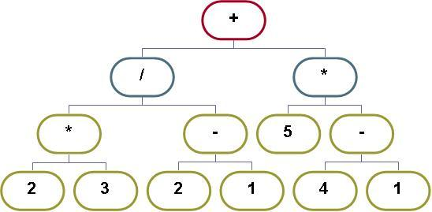

.. include:: <isopub.txt>

.. role:: kurt-code

Sample Algorithms using stack<>
===============================

Postfix to Infix Algorithm
--------------------------

Good examples that illustrate infix to post conversion can be found at this `NYU course site <http://www.cs.nyu.edu/courses/fall09/V22.0102-002/lectures/InfixToPostfixExamples.pdf>`_

Algorithm Description
^^^^^^^^^^^^^^^^^^^^^

This algorithm assumes left\ |ndash|\ to\ |ndash|\ right operator associtivity.

Scan infix input from left to right and repeat steps 2 to step 4.

1.  If an operand is encountered, add it to the postfix ouput.
2.  If a left parenthesis is encountered, push it onto the stack.
3.  If an operator is encountered, repeatedly pop operators of equal or greater precedence from the stack and add them
    to the output. Stop if a left parenthesis is encountered.

    Lastly, push the operator onto the stack.

4. If a right parenthesis is encountered, repeatedly pop operators from the stack and add them to the postfix
   output until a left parenthesis is encountered. Pop the left parenthesis.

Lastly, pop remaining operators from stack.  Several great examples are at: http://www.cs.nyu.edu/courses/fall09/V22.0102-002/lectures/InfixToPostfixExamples.pdf

.. code-block:: cpp
 
    #include <iostream>
    #include <utility>
    #include <stack>
    #include <string>
    #include <algorithm>
    #include <iostream>
    #include <sstream>
    #include <stdexcept>
    #include <ctype.h>
    
    class InfixToPostfix {

     public:
	InfixToPostfix();
	void processInput();

	friend istream& operator>>(istream& o, InfixToPostfix& x);
	friend ostream& operator<<(ostream& o, InfixToPostfix& x);
     private:
       int precedence(char token);
       void processOperator(char token);
       void processRightParenthesis();
       std::stringstream postfix;
       std::stack<char> operators;
     };   
    
     InfixToPostfix::InfixToPostfix() : postfix (stringstream::in | stringstream::out)
     {
     }
    
     istream& operator>>(istream& o, InfixToPostfix& p)
     {
	    p.processInput();
	    return o;
     }
    
     ostream& operator<<(ostream& o, InfixToPostfix& p)
     {
	    o << p.postfix.str() << endl;
	    return o;
     }
    
    int  InfixToPostfix::precedence(char token)
    {
        enum { lowest, mid, highest };
    
        switch (token) {
    
            case '+':
            case '-':
                return mid;
    
            case '/':
            case '*':
                return highest;
    
            default:
                return lowest;
        }
    }
    
    void InfixToPostfix::processInput()
    {
    char token;
        
        // read in a single character
        while (cin >> token) {
        
	        switch (token) {
        
	        case '+':
	        case '-':
	        case '*':
	        case '/':
		        processOperator(token);
		        break;
        
	        case ')':
		        processRightParenthesis();
		        break;
        
	        case '(':
		        operators.push(token);
		        break;
        
	        default:
	                // All operands must be numbers
                   float number;
        
                   if (isdigit(token)) {
        
    	               cin.putback(token);
        
    	               cin >> number;
        
                   } else {
                       string msg = string("Invalid Input: ") + token + " is not a digit\n";
    	               throw runtime_error(msg);
                   }
        
                   postfix << number << ' ';
	           continue;
        
	            }
            }
        
        for  (;!operators.empty(); operators.pop()) {
        
	     char top = operators.top();
	     postfix << top << ' ';
        }
        
        return;
    }
        /*
     * While stack is not empty and the top operator is not a left parenthesis,
     * remove any operators of greater or equal precedence from  stack and append
     * them to the output. When done, push current operator onto stack.
     */
    void InfixToPostfix::processOperator(char token)
    {
        while (!operators.empty() && operators.top() != '(') {
    
    		    char top = operators.top();
    
    		    if (precedence(top) < precedence(token)) {
    
    			    break;
    		    }
    
    		    postfix << top << ' ';
    		    operators.pop();
	    }
    
        operators.push(token);
    }
    /*
     * For ')' pop stack onto output until '(' found.
     */
    void InfixToPostfix::processRightParenthesis()
    {
       while (!operators.empty() && operators.top() != '(' ) {
        
	        char top = operators.top();
        
                postfix << top << ' ';
        
	        operators.pop();
        
        }
        
        // remove '('
        operators.pop();
    }  
    
    int main(int argc, char** argv)
    {
       cout << "Enter infix Expression: " << endl;
    
  	    InfixToPostfix processor;
    
  	    try {
    
  		    processor.processInput();
    
  		    cout << processor;
    
  	    } catch (runtime_error& e) {
    
  		    cout << e.what();
  	    }
    
	    return 0;
    }

    
Find directed path
------------------

Algorithm uses a stack to determine whether a flight exists from the origin city to the destination city. 

Cities are denoted using integers in the input file. Rows begin with the origin city, followed by all cities to which you can flight directly. 
. A stack is used for back\ |ndash|\ tracking.

.. code-block:: cpp

    #include <iostream>
    #include <ostream>
    #include <string>
    #include <vector>
    #include <map>
    #include <stack>
    #include <iterator>
    #include <fstream>
    #include <sstream>
    #include <string>
    #include <sstream>
    #include <algorithm>
    #include <iterator>
    #include <utility>
    
    using namespace std;
    
    class FlightMap {
    
          void markVisited(int city);
          bool getNextCity(int topCity, int& nextCity);
          void unvisitAll();
    
          struct adjacencyStruct {
    
    	     vector<int> destCities;
    	     bool visited;
    	     vector<int>::const_iterator iter;
    
             adjacencyStruct() : visited(false) {}
    	     void setVisited(bool b) { visited = b; }
    	     bool getVisited() { return visited; }
    
    	     friend ostream& operator<<(ostream& o, const adjacencyStruct& a)
    	     {
    		     o << " The vector of destinations cities: ";
    		     copy(a.destCities.begin(), a.destCities.end(), ostream_iterator<int>(o, " "));
    		     return o;
      	     }
          };
    
          map<int, adjacencyStruct>  adjacencyList;
    
      public:
         FlightMap(string);
         bool isPath(int origin, int dest);
    };
    
    class BadStuffexception: public exception
    {
      virtual const char* what() const throw()
      {
        return "The unexpected did happen!";
      }
    }; 

    FlightMap::FlightMap(string file_path)
    {
	    ifstream myfile (file_path.c_str());
    
            string line;
    
            //check to see if the file is opened:
            if (myfile.is_open()) {
    
               //while there are still lines in the
               //file, keep reading:
               for(int index = 0; ! myfile.eof(); index++) {
    
                 //place the line from myfile into the
                 //line string variable:
                 getline (myfile,line);

                 if (line == "") { // last line of text file is empty.
                 
  	               break;
        	 }
    
                 // read in the integers from the string
                 istringstream istr(line);
    
                 // the first is the destination city
                 int originCity;
    
                 istr >> originCity;
    
                 // add temporary list to vector
                 vector<int> destinations;
    
                 copy(istream_iterator<int>(istr), istream_iterator<int>(),
            		     back_inserter(destinations));
    
                 pair<map<int, adjacencyStruct>::iterator,bool> pr = adjacencyList.insert(pair<int, adjacencyStruct>(originCity, adjacencyStruct() ));
    
                 (pr.first)->second.destCities.swap(destinations);
    
               }
    
               //close the stream:
               myfile.close();
            }
             /* Debug code
             for(map<int, adjacencyStruct>::const_iterator iter = adjacencyList.begin();
        		     iter != adjacencyList.end(); iter++) {
    
        	     cout << "Origin is: " << iter->first << iter->second << endl;
             }
             */
    
    }
    
    // Set the visited flag to false in each adjacencyStruct.
    void FlightMap::unvisitAll()
    {
         for (map<int, adjacencyStruct>::iterator iter = adjacencyList.begin(); iter != adjacencyList.end(); iter++) {
    
	     iter->second.setVisited(false);
         }
    }
    
    // This method is called only once, each time a city is visited, immediately
    // after it has been pushed onto the stack (of visited cities).
    inline void  FlightMap::markVisited(int city)
    {
	    adjacencyStruct& s = adjacencyList[city];
    
            // Set the initial value for the vector's iterator.
	    s.iter = s.destCities.begin();
    
	    s.setVisited(true);
    }
    
    // Get the next yet-unvisited destination city.
    bool  FlightMap::getNextCity(int TopCity, int& nextCity)
    {
	    // If an destination city has not yet been visited, return it.
	    adjacencyStruct& s = adjacencyList[TopCity];
            
	    while (s.iter != s.destCities.end()) {
            		    
                   int index = *(s.iter);
                    
                   // advance iterator, so next time this method is called, we are
                   // already pointing to the next city
                   ++s.iter;
	                    
	           if (!adjacencyList[index].visited) {
    
			    nextCity = index;
                            
        		    return true;
		    }
                                    
	    } 
    
            return false;
    }
    
    bool FlightMap::isPath(int originCity, int destinationCity)
    // -----------------------------------------------------
    // Determines whether a sequence of flights between two
    // cities exists. Nonrecursive stack version.
    // Precondition: originCity and destinationCity are the city
    // numbers of the origin and destination cities,
    // respectively.
    // Postcondition: Returns true if a sequence of flights
    // exists from originCity to destinationCity; otherwise
    // returns false. Cities visited during the search are
    // marked as visited in the flight map.
    // Implementation notes: Uses a stack for the city
    // numbers of a potential path. Calls unvisitAll,
    // markVisited, and getNextCity.
    // -----------------------------------------------------
    {
       stack<int> aStack;
       int   topCity, nextCity;
       bool  success;
    
       unvisitAll();
    
       // push origin city onto aStack, mark it visited
       aStack.push(originCity);
    
       markVisited(originCity);
    
       topCity = aStack.top();
    
       while (!aStack.empty() && (topCity != destinationCity)) {  
          // Loop invariant: The stack contains a directed path
          // from the origin city at the bottom of the stack to
          // the city at the top of the stack
    
          // find an unvisited city adjacent to the city on the
          // top of the stack
          success = getNextCity(topCity, nextCity);
    
          if (!success) {
    
             aStack.pop();  // no city found; backtrack
          }
          else   {         // visit city
    
             aStack.push(nextCity);
             markVisited(nextCity);
          }
    
          if (!aStack.empty()) {
    
             topCity = aStack.top();
          }
       }  // end while
    
       // If stack empty, no path exists.
       return !aStack.empty();
    
    }

A program to test the FlightMap.

.. code-block:: cpp

    #include "flightmap.h"
    
    int main(int argc, char *argv[])
    {
       string directory = "/home/kurt/NetBeansProjects/stack2/";
       string file_name = "cities2.txt";
       
       FlightMap m(directory + file_name);
    
       pair<int, int> a[] = { make_pair(4, 8), make_pair(4, 2), make_pair(5, 9), make_pair(4, 9), make_pair(5, 3) };
    
       for (int i = 0; i < sizeof(a) / sizeof(pair<int, int>); i++) {
    
	       int origin = a[i].first;
	       int dest = a[i].second;
               
           try {
               
	       bool b = m.isPath(origin, dest);
    
	       string msg = b ? "is a path " : "is no path ";
    
	       cout << "There " << msg << " from " << "city " << origin << " to " << " city " << dest << endl;
               
           }  catch (exception& e) {
               
               cout << e.what() << endl;
               
           }
       }
    
	    return 0;
    }

Binary Expression Tree
----------------------

This algorithm converts a infix expression, consisting of numbers and arithemric operators, to a binary expression tree. 

   **Figure: Binary Expression Tree for 2 * 3 / ( 2 – 1 ) + 5 * ( 4 – 1 )**

It is implemented using two stacks: one holds arithmetic operators, the other stack holds the operands, which are binary expression tree nodes.

The nodes are of two types: NumericElementNode, which is always a leaf node, or BinaryOperationNode, which is an internal node or the root.
Both classes derive from the abstract ExpressionElementNode and must implement its abstract virtual value() method. 

.. code-block:: cpp

    // Inspired from code at: http://math.hws.edu/eck/cs225/s03/binary_trees/
    // Represents a node of any type in an expression tree.
    // This is an "abstract" class, since it contains an undefined
    // function, value(), that must be defined in subclasses.
    class ExpressionElementNode {
       public:     
        virtual double value() = 0;  // Return the value of this node.
    }; 
    
    class NumericElementNode : public ExpressionElementNode {
    
       private:
          double number;    
          NumericElementNode(const NumericElementNode& n);
          NumericElementNode();
          NumericElementNode&operator=(const NumericElementNode& n);
       public:
    
          NumericElementNode( double val );
          virtual double value();
    };
    
    inline NumericElementNode::NumericElementNode( double val ) : number(val) {}
    
    inline double NumericElementNode::value()
    {
       return number;
    }
    
    class BinaryOperationNode : public ExpressionElementNode {
    
      private:
    
         char binary_op;
         
         ExpressionElementNode *left;
         ExpressionElementNode *right; 
         
         BinaryOperationNode(const BinaryOperationNode& n);
         BinaryOperationNode();
         BinaryOperationNode &operator=(const BinaryOperationNode& n);
         
      public:    
        BinaryOperationNode(char op, ExpressionElementNode *l, ExpressionElementNode *r);
        
        virtual double value();
    };
    
    inline BinaryOperationNode::BinaryOperationNode(char op, ExpressionElementNode *l, ExpressionElementNode *r) :
										 binary_op(op), left(l), right(r) {}

The recursive method ``BinaryOperationNode::value()`` is implemented in Nodes.cpp. It recursively calls value() until a leaf node of type
NumericElementNodes returns a **double**.

.. code-block:: cpp
        
    #include "Nodes.h"
    
    using namespace std;
    
    double BinaryOperationNode::value()
    {
       // To get the value, compute the value of the left and
       // right operands, and combine them with the operator.
       double leftVal = left->value();
    
       double rightVal = right->value();
       
       double result;
             
       switch ( binary_op ) {
           
           case '+':  result = leftVal + rightVal;
                      break;
                      
           case '-':  result = leftVal - rightVal;
                      break;
                      
           case '*':  result = leftVal * rightVal;
                      break;
                      
           case '/':  result = leftVal / rightVal;
                      break;
       }
       
       return result;
    }

The BinaryExpressionBuilder class is used to parse the infix expression string and to return the binary expression tree. 

.. code-block:: cpp

    #include <string>
    #include <stack>
    #include <exception>
    
    class ExpressionElementNode;
    class BinaryOperationNode;
    
    class BinaryExpressionBuilder {
    
       private:
         // holds either (, +, -, /, or *
         std::stack<char> operatorStack; 
       
         // operandStack is made up of BinaryOperationNodes and NumericElementNode
         std::stack<ExpressionElementNode *> operandStack;
                  
         void processOperator(char op);
         void processRightParenthesis();
       
         void doBinary(char op);
    
         int precedence(char op);
    
       public:
        
         class NotWellFormed : public std::exception {
            
            public:
              virtual const char* what() const throw()
              {
                    return "The expression is not valid";
              }
          };
        
         BinaryOperationNode *parse(std::string& istr) throw(NotWellFormed);
    };
    
The workhorse routine is ``doBinary(char op)``, which consumes elements of the operand stack and replaces them with ``BinaryOperationNode``. It takes as input the top two elements of the operator stack to create a ``BinaryOperationNode``. The first
element removed becomes the **right** subtree and the second element popped becomes the **left** subtree. The new BinaryOperationNode is then pushed onto the stack. 
This loop at the end of ``BinaryExpressionBuilder::parse(std::string& str)`` 

.. code-block:: cpp

    while (!operatorStack.empty()) {
            
            doBinary( operatorStack.top() );
            operatorStack.pop();
    }

calls ``doBinary(op)`` until the operator stack is empty. doBinary(), as just mentioned, removes the top two operands from the operand stack, creates from them
a ``BinaryExpressionNode``, which it pushes onto the operand stack. Eventually, when the loop ends, the only element in the stack will be the ``BinaryExpressionNode``
that represents the input infix string as a complete binary expression tree. 

.. code-block:: cpp

    #include "BinaryExpressionBuilder.h"
    #include "Nodes.h"
    #include <sstream>
    
    using namespace std;
    
    int BinaryExpressionBuilder::precedence(char op)
    {
        enum { lowest, mid, highest };
        
        switch (op) {
            
            case '+':
            case '-':
                return mid;
                
            case '/':
            case '*':
                return highest;
                
            default:
                return lowest;
        }
    }
    
    // Input: +, -, /, or *
    // creates BinaryOperationNode's from all preceding
    BinaryOperationNode *BinaryExpressionBuilder::parse(std::string& str) throw(NotWellFormed)
    {
        istringstream istr(str);
        char token;
                
        while (istr >> token) {
    
            switch (token) {
                
		    case '+':
		    case '-':
		    case '*':
		    case '/':
			    processOperator(token);
			    break;
    
		    case ')':
			    processRightParenthesis();
			    break;
    
		    case '(':
			    operatorStack.push(token);
			    break;
    
		    default:
			    // If it is not an operator, it must be a number.
                            // Since token is only a char in width, we put it back,
                            // and get the complete number as a double.
                            istr.putback (token);
                            double number;
                            
                            istr >> number;
                                              
                            NumericElementNode *newNode = new NumericElementNode(number); 
                            operandStack.push(newNode);
                        			    
			    continue;
            } // end switch
        }    // end while
        
        while (!operatorStack.empty()) {
            
            doBinary( operatorStack.top() );
            operatorStack.pop();
        }
        
        // Invariant: At this point the operandStack should have only one element
        //     operandStack.size() == 1 
        // otherwise, the expression is not well formed.
        if ( operandStack.size()  != 1) {
            
            throw NotWellFormed();
        }
        
        ExpressionElementNode *p = operandStack.top();
        
        return static_cast<BinaryOperationNode *>(p);
    }
    
    void BinaryExpressionBuilder::processOperator(char op)
    {
        // pop operators with higher precedence and create their BinaryOperationNode
        int opPrecedence = precedence(op);
    
        while ((!operatorStack.empty()) && (opPrecedence <= precedence( operatorStack.top() ) ) )  {
                    
            doBinary( operatorStack.top() ); 
	    operatorStack.pop();
        }
        
        // lastly push the operator passed onto the operatorStack 
        operatorStack.push(op);
    }
    
    void BinaryExpressionBuilder::processRightParenthesis()
    {
        while (!operatorStack.empty() && operatorStack.top() != '(' ) {
    
	    doBinary( operatorStack.top() );
            operatorStack.pop();
        }
    
        operatorStack.pop(); // remove '('
    }
    
    // Creates a BinaryOperationNode from the top two operands on operandStack
    // These top two operands are removed (poped), and the new BinaryOperation
    // takes their place on the top of the stack.
    void BinaryExpressionBuilder::doBinary(char op)
    {
        ExpressionElementNode *right = operandStack.top();
        
        operandStack.pop();
            
        ExpressionElementNode *left = operandStack.top();
        
        operandStack.pop();
       
        BinaryOperationNode *p= new BinaryOperationNode(operatorStack.top(), left, right);
        
        operandStack.push(p);
    }

A command line program to to parse an infix expression, build a binary expression tree and output the result of the expression:

.. code-block:: cpp

    /* 
     * File: main.cpp
     */
    
    #include <cstdlib>
    #include <iostream>
    #include "Nodes.h"
    #include "BinaryExpressionBuilder.h"
    using namespace std;
    
    nt main(int argc, char** argv) 
    {
     
        NumericElementNode num1(10);
        NumericElementNode num2(20);
        BinaryOperationNode n('+', &num1, &num2);
        
        BinaryExpressionBuilder b;
        
        cout << "Enter expression" << endl;
        
        string expression;
        getline(cin, expression);
        
        BinaryOperationNode *root = b.parse(expression);
        
        cout << " result = " << root->value();    
        return 0;
    }
